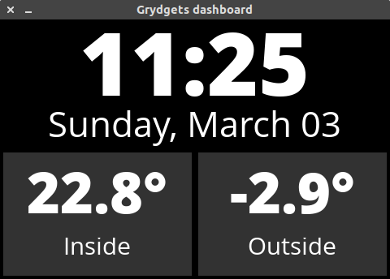

# Grydgets

Grydgets is an easy tool to create widget-based animated dashboards.
It runs on anything that supports Python, PyGame, and SDL: from the oldest Raspberry Pi to a full-blown modern PC.



## Installation

The project is still very much a work in progress. For now, the only way to run it is to clone the repository and set up
all the dependencies by yourself.

```
git clone https://github.com/iamjackg/grydgets
pip install pygame requests voluptuous
```

## Configuration

### General options

Grydgets' configuration is stored in `conf.yaml` in its main folder. A sample file is provided in the repo.

These are the currently available options:

```yaml
graphics:
  fps-limit: 10
  fb-device: '/dev/fb1'
  x-display: ':0'
  fullscreen: True
  resolution: [480, 320]
logging:
  level: info
```

`fb-device` is only needed if you're using a non-standard display device, like an SPI screen on the Raspberry Pi.
Similarly, `x-display` is necessary if you're trying to start Grydgets via ssh, and the `DISPLAY` environment variable
is not properly set.

## Widgets

Grydgets, as the name suggests, draws dashboards based on a series of _widgets_. Widgets are generally of two types:
normal widgets, and container widgets.

Normal widgets usually draw something specific on the screen: a clock, the result of a REST call, a picture, etc.

Container widgets determine where and how other widgets appear, for example laying them out in a grid. They can also
affect their appearance, for example by adding a label underneath another widget.

The tree of widgets that composes your dashboard must be specified in a file called `widgets.yaml` in the main folder. A
sample file is included in the repository.

### Container widgets

All container widgets take a `children` parameter, specifying a list of widgets they're supposed to contain.

#### grid

A widget that allows you to place other widgets in a grid layout.

It supports the following parameters:

* `rows`: the amount of rows
* `columns`: the amount of columns
* `padding` _(optional)_: the amount of padding around each child widget, in pixels
* `color` _(optional)_: a background color for every cell in the grid, as a list of RGB components
* `row_ratios` _(optional)_: a list representing the relative ratio of each row
* `column_ratios` _(optional)_: a list representing the relative ratio of each column

Example:

```yaml
  - widget: grid
    rows: 2
    columns: 2
    padding: 4
    color: [50, 50, 50]
    row_ratios: [1, 2]
    column_ratios: [1, 2]
```

#### label

A widget that lets you add a label above or below another widget.

It supports the following parameters:

* `text`: the amount of rows
* `font_path` _(optional)_: the path to a ttf file to use as font
* `position` _(optional)_: `above` or `below` the child widget
* `text_size` _(optional)_: the size of the label text

Example:

```yaml
  - widget: label
    text: 'Random person'
    position: below
    text_size: 30
```

#### flip

A widget that will transition between each child widget at a specified interval, with custom easing and
transition time.

It supports the following parameters:

* `interval` _(optional)_: how long to wait before switching to the following widget. Defaults to 5 seconds.
* `transition` _(optional)_: how long the animation for transitioning to the following widget should last. Defaults to 1
second.
* `ease` _(optional)_: determines the ease factor of the transition animation. Defaults to 2

Example:

```yaml
  - widget: flip
    interval: 5
    transition: 1
    ease: 3
```

### Normal widgets

#### text

A simple widget that displays some text.

It supports the following parameters:

* `text` _(optional)_: the text to display. Defaults to ''
* `text_size` _(optional)_: the size of the text in pixels. Defaults to automatic
* `font_path` _(optional)_: the path to a ttf file to use as font. Defaults to a standard font
* `color` _(optional)_: the color of the text. Defaults to black
* `padding` _(optional)_: the amount of padding around the text in pixels. Defaults to 0
* `align` _(optional)_: the horizontal alignment for the text. One of `left`, `center`, or `right`. Defaults to left
* `vertical_align` _(optional)_: the vertical alignment for the text. One of `top`, `center`, or `bottom`. Defaults to
top

#### dateclock

A widget that displays a 24-hour clock at the top, and the current date at the bottom.

It supports the following parameters:

* `time_font_path` _(optional)_: the path to a ttf file to use as font for the time. Defaults to a standard font
* `date_font_path` _(optional)_: the path to a ttf file to use as font for the date. Defaults to a standard font

#### rest

A widget that makes periodic HTTP requests and displays the response text. It supports json and custom formatting of the final
text, and auto-updates every 30 seconds.

It supports the following parameters:

* `url`: the URL to retrieve.
* `auth` _(optional)_: a dictionary of auth options. Currently only supports a `bearer` key to supply a Bearer token.
* `json_path` _(optional)_: the path to the json item to extract. Currently only supports objects, not arrays.
* `format_string` _(optional)_: a python format string to be used to format the final text.
* `font_path` _(optional)_: the path to a ttf file to use as font. Defaults to a standard font
* `text_size` _(optional)_: the size of the text in pixels. Defaults to automatic

Example:

```yaml
  - widget: rest
    url: 'https://jsonplaceholder.typicode.com/users/1'
    json_path: 'address.city'
    format_string: 'lives in {}'
    text_size: 70
```

#### restimage

A widget that makes periodic HTTP requests and displays the retrieved image file.
It also supports extracting a URL from a json response and retrieving the resulting image.

It supports the following parameters:

* `url`: the URL to retrieve.
* `auth` _(optional)_: a dictionary of auth options. Currently only supports a `bearer` key to supply a Bearer token.
* `json_path` _(optional)_: the path to the json item that contains an image URL to retrieve.
Currently only supports objects, not arrays.


#### image

A widget that displays an image. Currently only accepts binary image data.

It supports the following parameters:

* `image_data` _(optional)_: binary contents of the image to display.