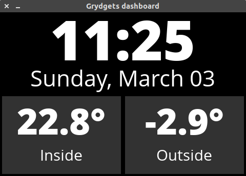

# Grydgets

Grydgets allows you to easily create widget-based dashboards that update in real time, showing local and online data.
It runs on anything that supports Python, PyGame, and SDL, from the oldest Raspberry Pi to a full-blown modern PC.



_Note:_ while the vast majority of the codebase was originally written by me, my free time has been dwindling more and more. Recent changes have been almost entirely developed with Claude Code. I have reviewed and tested the output, and I am using Grydgets myself 24/7.

## Installation

### From source (recommended for Raspberry Pi)

```bash
git clone https://github.com/iamjackg/grydgets
cd grydgets

# uv (recommended)
uv sync
uv run grydgets

# pip
python3 -m venv venv
venv/bin/pip install .
venv/bin/grydgets
```

To update an existing installation:

```bash
git pull
uv sync          # or: venv/bin/pip install .
```

`python main.py` still works as a shortcut if you prefer not to install the package.

### Docker (headless mode)

A Dockerfile and docker-compose configuration are provided for running Grydgets in headless mode.

1. Create a `data/` directory with your configuration files, fonts, and images:

```
data/
├── conf.yaml
├── widgets.yaml
├── providers.yaml
├── secrets.yaml          # optional
├── OpenSans-Regular.ttf  # fonts referenced in widgets.yaml
├── OpenSans-ExtraBold.ttf
└── images/               # images referenced in widgets.yaml
    └── weather/
```

2. Make sure `conf.yaml` has a file output configured (see [Outputs](#outputs)).

3. Start the container:

```bash
docker compose up -d
```

Rendered images will appear in `data/headless_output/`. The notification endpoint is exposed on port 5000.

### Command-line options

```
grydgets [--widgets FILE] [--config-dir DIR]
```

*   `--widgets` — Widget configuration file (default: `widgets.yaml`)
*   `--config-dir` — Directory containing config files, fonts, and images. All relative paths are resolved from this directory. Defaults to the current working directory.

## Configuration

### General Grydgets options (`conf.yaml`)

Configuration for Grydgets must be stored in a `conf.yaml` file in its main folder. A sample file is provided in the repo.

#### Render settings

```yaml
graphics:
  fps-limit: 10
  resolution: [480, 320]
  smooth-scaling: true
  flip: false
logging:
  level: info
server:
  port: 5000
```

*   `fps-limit`: Maximum frames per second. Defaults to `60`.
*   `resolution`: Screen resolution as `[width, height]`.
*   `smooth-scaling` _(optional)_: Use bilinear filtering for image scaling (`true`, default) or faster nearest-neighbor (`false`). Set to `false` on low-power hardware like a Raspberry Pi 2.
*   `flip` _(optional)_: Rotate the output 180 degrees. Defaults to `false`.

### Outputs

Grydgets uses a pluggable output system. You can configure one or more outputs to control where the rendered dashboard is displayed or sent. Add an `outputs` list to `conf.yaml`:

```yaml
outputs:
  - type: window
    fullscreen: true
```

If no `outputs` key is present, Grydgets falls back to legacy behavior based on the `graphics` and `headless` keys (see [Legacy Configuration](#legacy-configuration)).

**Rules:**
- At most one display output (`window` or `framebuffer`)
- Any number of non-display outputs (`file`, `post`)
- At least one output is required
- If no display output is configured, SDL runs in dummy mode (no screen needed)

#### window

Displays the dashboard in an SDL window.

*   `fullscreen` _(optional)_: Run in fullscreen mode. Defaults to `false`.
*   `x_display` _(optional)_: X display to use (e.g. `":0"`). Only needed when starting via SSH.

```yaml
outputs:
  - type: window
    fullscreen: true
    x_display: ":0"
```

#### framebuffer

Renders directly to a Linux framebuffer device (e.g. SPI screens on Raspberry Pi).

*   `device`: Path to the framebuffer device (e.g. `"/dev/fb1"`).

```yaml
outputs:
  - type: framebuffer
    device: /dev/fb1
```

#### file

Saves rendered images to disk at regular intervals. Ideal for web dashboards, monitoring, or timelapse.

*   `output_path` _(optional)_: Directory for saved images. Defaults to `"./headless_output"`.
*   `render_interval` _(optional)_: Seconds between saves. Defaults to `60`.
*   `image_format` _(optional)_: `png`, `jpg`, `jpeg`, or `bmp`. Defaults to `"png"`.
*   `filename_pattern` _(optional)_: Pattern with `{timestamp}` and `{sequence}` placeholders. Defaults to `"grydgets_{timestamp}"`.
*   `keep_images` _(optional)_: Keep the last N images, deleting older ones. `0` = unlimited. Defaults to `100`.
*   `create_latest_symlink` _(optional)_: Create a `latest.{format}` symlink to the newest image. Defaults to `true`.

```yaml
outputs:
  - type: file
    output_path: "/var/www/html/dashboard"
    render_interval: 60
    image_format: png
    keep_images: 1440
```

#### post

Pushes the rendered image via HTTP POST to a remote endpoint. Works with any device or service that accepts image uploads — networked displays, smart signage, ingestion APIs, etc.

*   `url`: The endpoint to POST to.
*   `image_format` _(optional)_: `png`, `jpg`, `jpeg`, or `bmp`. Defaults to `"png"`.
*   `trigger` _(optional)_: When to push. `"on_dirty"` only pushes when content has changed. `"interval"` pushes on a fixed schedule regardless. Defaults to `"on_dirty"`.
*   `min_interval` _(optional)_: Minimum seconds between pushes. Defaults to `60`.
*   `auth` _(optional)_: Authentication. Supports `bearer` token or `basic` username/password.
*   `multipart` _(optional)_: Send the image as a `multipart/form-data` upload instead of raw bytes. Required for endpoints that expect a browser-style file upload.
    *   `field_name` _(optional)_: The form field name. Defaults to `"file"`.
    *   `filename` _(optional)_: The filename reported in the upload. Defaults to `image.<format>` (e.g. `image.jpeg`).
*   `after_post` _(optional)_: An additional HTTP request to fire after a successful upload. Useful for devices that require a separate "apply" or "display" call once the upload is complete.
    *   `url`: The URL to request.
    *   `method` _(optional)_: HTTP method. Defaults to `"GET"`.

By default the POST sends raw image bytes with the appropriate `Content-Type` header (`image/png`, `image/jpeg`, etc.). POSTs run in a background thread and will not block the main loop.

```yaml
outputs:
  - type: post
    url: https://display.local/image
    image_format: jpeg
    trigger: on_dirty
    min_interval: 300
    auth:
      bearer: !secret display_token
```

For devices that use a multipart file upload and require a separate call to display the image:

```yaml
outputs:
  - type: post
    url: http://display.local/doUpload?dir=/image/
    image_format: jpeg
    trigger: on_dirty
    min_interval: 60
    multipart:
      field_name: file
    after_post:
      url: http://display.local/set?img=/image/image.jpeg
```

#### Combining outputs

You can use multiple outputs simultaneously. For example, display on screen while also pushing to a remote display:

```yaml
outputs:
  - type: window
    fullscreen: true
  - type: post
    url: https://display.local/image
    image_format: jpeg
    trigger: on_dirty
    min_interval: 300
```

Or save to disk and push to a remote endpoint (no display needed):

```yaml
outputs:
  - type: file
    output_path: "./snapshots"
    render_interval: 300
  - type: post
    url: https://dashboard-api.example.com/ingest
    trigger: interval
    min_interval: 60
```

#### Legacy configuration

For backwards compatibility, Grydgets still accepts the old `graphics` display settings and `headless` key. These are automatically translated to the new output system:

*   `headless.enabled: true` becomes a `file` output
*   `graphics.fb-device` becomes a `framebuffer` output
*   Otherwise, a `window` output is created from `graphics.fullscreen`

If you add an `outputs` key, the legacy display settings (`fullscreen`, `fb-device`, `x-display`) and `headless` block are ignored.

**Important:** Switching between display and non-display modes requires restarting Grydgets. Configuration hot-reload (`SIGUSR1`) will warn and skip the change if the display mode changes.

### Data Providers (`providers.yaml`)

Data providers allow you to fetch data in the background and share it across multiple widgets, eliminating redundant API calls. For example, if you have a widget for the weather forecast of each day of the week, a single provider can fetch all weather data once and make it available to all daily widgets.

Providers are configured in `providers.yaml`:

```yaml
providers:
  hass_calendar:
    type: rest
    url: !secret hass_calendar_url
    headers:
      Authorization: !secret hass_bearer_token
    json_path: "events"  # Extract this from response
    jq_expression: 'map(select(.status == "active"))'  # Further filter with jq
    update_interval: 60  # Fetch every 60 seconds
    jitter: 5  # Add random 0-5 second delay

  weather_api:
    type: rest
    url: https://api.weather.com/current
    method: GET
    auth:
      bearer: !secret weather_token
    update_interval: 300
```

#### Provider Configuration Options

*   `type`: Provider type. Currently only `rest` is supported.
*   `url`: The URL to fetch from (required).
*   `method` _(optional)_: HTTP method (`GET`, `POST`, `PUT`, `DELETE`). Defaults to `GET`.
*   `headers` _(optional)_: Dictionary of HTTP headers.
*   `params` _(optional)_: Dictionary of query parameters.
*   `body` or `payload` _(optional)_: Request body for POST/PUT requests.
*   `auth` _(optional)_: Authentication options (see [Authentication Schemes](#authentication-schemes)).
*   `json_path` _(optional)_: Simple JSON path to extract from response (e.g., `"events[0].title"`).
*   `jq_expression` _(optional)_: jq expression for complex data transformations (e.g., `'.events[] | select(.active)'`).
*   `update_interval` _(optional)_: Seconds between fetches. Defaults to `60`.
*   `jitter` _(optional)_: Random seconds (0 to this value) added to update interval. Defaults to `0`.

**Note:** If both `json_path` and `jq_expression` are provided, `json_path` is applied first, then `jq_expression` processes the result. This allows you to pre-filter data before complex transformations.

### Dashboard layout options (`widgets.yaml`)

The tree of widgets that composes your dashboard must be specified in a file called `widgets.yaml` in the main folder. A
sample file is included in the repository.

The top-level of your `widgets.yaml` defines options for the implicit main screen, which acts as a `ScreenWidget` container for your entire dashboard.

*   `background_image` _(optional)_: The path to an image file to use as the background for the entire screen.
*   `background_color` _(optional)_: A color for the screen background, as a list of RGB or RGBA components. Defaults to `[0, 0, 0]` (black).
*   `drop_shadow` _(optional)_: If `true`, a drop shadow effect will be applied to the main content of the screen. Defaults to `false`.
*   `widgets`: A list containing the root widget(s) of your dashboard. Note that the `ScreenWidget` currently only supports a single child widget.

## Widgets

Grydgets, as the name suggests, draws dashboards based on a series of _widgets_. Widgets are generally of two types:
Normal and Container.

**Normal widgets** draw something specific on the screen: a clock, the result of a REST call, an image, etc.

**Container widgets** determine where and how other widgets appear. For example, a Grid widget allows you to lay other
widgets out in a grid. They can also affect their appearance, for example by adding a label below or above another
widget.

### General Widget Parameters

Most widgets support the following optional parameters:

*   `name` _(optional)_: A unique name for the widget instance. This is used for logging and for identifying notifiable widgets. If not provided, the widget type name is used.

### Authentication Schemes

Widgets that make HTTP requests (e.g., `rest`, `restimage`, `httpflip`) often support an `auth` parameter. This is a dictionary specifying the authentication method:

*   `bearer`: A string representing a Bearer token.
*   `basic`: An object containing `username` and `password` strings for Basic authentication.

Example `auth` configuration:

```yaml
auth:
  bearer: !secret my_bearer_token
# OR
auth:
  basic:
    username: myuser
    password: mypassword
```

### Container widgets

All Container widgets take a `children` parameter, specifying the list of widgets they're going to contain.

#### grid

A widget that allows you to place other widgets in a grid layout.

It supports the following parameters:

*   `rows`: The number of rows in the grid.
*   `columns`: The number of columns in the grid.
*   `padding` _(optional)_: The amount of padding around each child widget, in pixels. Defaults to `0`.
*   `color` _(optional)_: A background color for the grid itself (the "empty" space between widgets or behind the entire grid), as a list of RGB or RGBA components.
*   `widget_color` _(optional)_: A background color for each *child widget's cell*, as a list of RGB or RGBA components.
*   `corner_radius` _(optional)_: The corner radius for the overall grid background, in pixels. Defaults to `0`.
*   `widget_corner_radius` _(optional)_: The corner radius for each child widget's background, in pixels. Defaults to `0`.
*   `image_path` _(optional)_: The path to an image file to use as the background for the entire grid.
*   `drop_shadow` _(optional)_: If `true`, a drop shadow effect will be applied to the child widgets within the grid. Defaults to `false`.
*   `row_ratios` _(optional)_: A list representing the relative ratio of each row's height. E.g., `[1, 2]` means the second row will be twice as tall as the first. If not provided, rows have equal height.
*   `column_ratios` _(optional)_: A list representing the relative ratio of each column's width. E.g., `[1, 2]` means the second column will be twice as wide as the first. If not provided, columns have equal width.

Example:

```yaml
  - widget: grid
    rows: 2
    columns: 2
    padding: 4
    color: [50, 50, 50]
    widget_color: [70, 70, 70, 180]
    corner_radius: 10
    widget_corner_radius: 5
    row_ratios: [1, 2]
    column_ratios: [1, 2]
```

#### label

A widget that lets you add a text label above or below another widget. It can only have one child.

It supports the following parameters:

*   `text`: The text to display as the label.
*   `font_path` _(optional)_: The path to a ttf file to use as font for the label text.
*   `position` _(optional)_: `above` or `below` the child widget. Defaults to `above`.
*   `text_size` _(optional)_: The size of the label text in pixels.
*   `text_color` _(optional)_: The color of the label text, as a list of RGB or RGBA components. Defaults to `[255, 255, 255]` (white).

Example:

```yaml
  - widget: label
    text: 'Random person'
    position: below
    text_size: 30
    text_color: [255, 255, 0]
    children:
      - widget: rest # ... some child widget
```

#### flip

A widget that will transition between each child widget at a specified interval, with custom easing and
transition time.

It supports the following parameters:

*   `interval` _(optional)_: How long to wait before switching to the following widget, in seconds. Defaults to `5` seconds.
*   `transition` _(optional)_: How long the animation for transitioning to the following widget should last, in seconds. Defaults to `1` second.
*   `ease` _(optional)_: Determines the ease factor of the transition animation. Higher values make the transition more abrupt at the beginning/end. Defaults to `2`.

Example:

```yaml
  - widget: flip
    interval: 5
    transition: 1
    ease: 3
    children:
      - widget: text # first child
      - widget: restimage # second child
```

#### httpflip

A specialized `flip` widget that determines which child widget to display based on an HTTP request response.

It supports the following parameters:

*   `url`: The URL to retrieve the value from.
*   `mapping`: A dictionary where keys are expected response values (or extracted JSON paths) and values are the `name` of the child widget to display.
*   `default_widget`: The `name` of the child widget to display if the response value does not match any entry in `mapping`.
*   `json_path` _(optional)_: The path to the json item to extract from the HTTP response. If not provided, the raw response text is used.
*   `jq_expression` _(optional)_: jq expression to extract the comparison value from the JSON response. If both `json_path` and `jq_expression` are provided, `json_path` is applied first.
*   `auth` _(optional)_: Authentication options (see [Authentication Schemes](#authentication-schemes)).
*   `method` _(optional)_: The HTTP method to use (`GET` or `POST`). Defaults to `GET`.
*   `payload` _(optional)_: A dictionary representing the JSON payload for `POST` requests.
*   `update_frequency` _(optional)_: How often the HTTP request should be made, in seconds. Defaults to `30` seconds.
*   `static` _(optional)_: If `true`, the HTTP request is made only once on startup and never repeated. Useful when the mapped value is known to be fixed. Defaults to `false`.

**Inherited from `flip` widget:**
*   `interval` _(optional)_: How long to wait before checking for changes, in seconds. Defaults to `5` seconds.
*   `transition` _(optional)_: How long the animation for transitioning should last, in seconds. Defaults to `1` second.
*   `ease` _(optional)_: Determines the ease factor of the transition animation. Higher values make the transition more abrupt at the beginning/end. Defaults to `2`.

Example:

```yaml
  - widget: httpflip
    default_widget: motioneye-cam
    update_frequency: 60
    url: "https://homeassistant.example.com/api/template"
    method: POST
    auth:
      bearer: !secret hass_token
    payload:
      template: '{{ (now() > today_at("18:00")) and (now() - states.switch.sonoff_meter_plug_4_relay.last_changed).seconds < (60*60*2) }}'
    mapping:
      "False": main-cam
      "True": other-cam
    children:
      - widget: restimage
        name: main-cam
        url: http://192.168.255.34/image.jpg
      - widget: restimage
        name: other-cam
        url: 'https://motioneye.example.com/picture/13/current'
```

#### scheduleflip

A specialized `flip` widget that determines which child widget to display based on a time schedule. It inherits all parameters from `flip` widgets.

It supports the following parameters:

*   `schedule`: A dictionary mapping time strings (`HH:MM` format) to the `name` of the child widget to display at or after that time, until the next scheduled time.
*   `interval` _(optional)_: How long to wait before checking the schedule again, in seconds. Defaults to `5` seconds.
*   `transition` _(optional)_: How long the animation for transitioning to the following widget should last, in seconds. Defaults to `1` second.
*   `ease` _(optional)_: Determines the ease factor of the transition animation. Defaults to `2`.

Example:

```yaml
  - widget: scheduleflip
    schedule:
      "08:00": morning-widget
      "18:00": evening-widget
    children:
      - widget: text
        name: morning-widget
        text: "Good Morning!"
      - widget: text
        name: evening-widget
        text: "Good Evening!"
```

#### pill

A specialized container widget that superimposes a pill-shaped overlay on top of a base widget. Useful for adding badges, status indicators, or additional information overlays on images or complex widgets.

It supports the following parameters:

*   `circular_mask` _(optional)_: If `true`, applies a circular mask to the base (first) widget. Defaults to `false`.
*   `widget_background_color` _(optional)_: Background color for the masked widget when using circular mask. As RGB or RGBA.
*   `pill_background_color` _(optional)_: Background color for the pill overlay. As RGB or RGBA. Defaults to transparent.
*   `pill_width_percent` _(optional)_: Width of the pill as a percentage of container width (0.0-1.0). Defaults to `0.8`.
*   `pill_height_percent` _(optional)_: Height of the pill as a percentage of container height (0.0-1.0). Defaults to `0.2`.
*   `pill_position_x` _(optional)_: Horizontal center position of the pill (0.0-1.0). Defaults to `0.5` (centered).
*   `pill_position_y` _(optional)_: Vertical center position of the pill (0.0-1.0). Defaults to `0.8` (lower area).
*   `pill_corner_radius` _(optional)_: Corner radius for the pill shape in pixels. If not specified, the pill is fully rounded (semicircular ends).
*   `pill_size_relative_to_circle` _(optional)_: If `true` and `circular_mask` is enabled, the pill size is relative to the circle diameter. Defaults to `false`.
*   `children`: Exactly 2 child widgets. First is the base widget, second is the overlay widget.

Example:

```yaml
  - widget: pill
    circular_mask: true
    widget_background_color: [40, 0, 40, 150]
    pill_background_color: [0, 0, 0, 150]
    pill_width_percent: 1.4
    pill_height_percent: 0.25
    pill_position_y: 0.85
    pill_size_relative_to_circle: true
    children:
      - widget: restimage
        url: "file://images/profile.png"
        preserve_aspect_ratio: true
      - widget: text
        text: "Online"
        font_path: 'OpenSans-Regular.ttf'
        color: [0, 255, 0]
        align: center
```

#### notifiabletext

A container widget that can display a temporary text notification over its main child widget. It can only have one child.

It supports the following parameters:

*   `font_path`: The path to a ttf file to use as font for the notification text.
*   `padding` _(optional)_: The amount of padding around the notification text in pixels. Defaults to `0`.
*   `text_size` _(optional)_: The size of the notification text in pixels.
*   `color` _(optional)_: The default color of the notification text, as a list of RGB or RGBA components. Defaults to `[255, 255, 255]` (white).

To send a notification, send a POST HTTP request to the port configured in `conf.yaml`.

Example:

```yaml
  - widget: notifiabletext
    name: fullscreen-notification
    font_path: 'OpenSans-ExtraBold.ttf'
    padding: 10
    text_size: 100
    children:
      - widget: grid # ... main content widget
```

```bash
curl -X POST \
     -H "Content-Type: application/json" \
     -d '{"widget": "fullscreen-notification", "text": "This is a test notification from curl!", "duration": 10}' \
     http://192.168.1.1:5000/notify
```


#### notifiableimage

A container widget that can display a temporary image notification over its main child widget. It can only have one child.

It supports the following parameters:

*   No specific configuration parameters beyond the common `name`.

TTo send a notification, send a POST HTTP request to the port configured in `conf.yaml` with `url` (of the image) and `duration` (optional, in seconds).

Example:

```yaml
  - widget: notifiableimage
    name: fullscreen-notification-image
    children:
      - widget: notifiabletext # ... main content widget (which itself could be notifiable)
```

```bash
curl -X POST \
     -H "Content-Type: application/json" \
     -d '{"widget": "fullscreen-notification-image", "url": "https://example.com/your_image.jpg"}' \
     http://192.168.1.1:5000/notify
```


### Normal widgets

#### text

A simple widget that displays some text.

It supports the following parameters:

*   `text` _(optional)_: The text to display. Defaults to an empty string `''`.
*   `text_size` _(optional)_: The size of the text in pixels. If not provided, it automatically adjusts to fit the widget's height.
*   `font_path` _(optional)_: The path to a ttf file to use as font. If not provided, Pygame's default font is used.
*   `color` _(optional)_: The color of the text, as a list of RGB or RGBA components. Defaults to `[255, 255, 255]` (white).
*   `padding` _(optional)_: The amount of padding around the text in pixels. Defaults to `0`.
*   `align` _(optional)_: The horizontal alignment for the text. One of `left`, `center`, or `right`. Defaults to `left`.
*   `vertical_align` _(optional)_: The vertical alignment for the text. One of `top`, `center`, or `bottom`. Defaults to `top`.

Example:

```yaml
  - widget: text
    text: 'Hello Grydgets!'
    text_size: 50
    font_path: 'OpenSans-Regular.ttf'
    color: [0, 255, 0]
    align: center
    vertical_align: center
```

#### dateclock

A widget that displays a 24-hour clock at the top, and the current date at the bottom.

It supports the following parameters:

*   `time_font_path`: The path to a ttf file to use as font for the time.
*   `date_font_path`: The path to a ttf file to use as font for the date.
*   `color` _(optional)_: The color of the time and date text, as a list of RGB or RGBA components. Defaults to `[255, 255, 255]` (white).
*   `background_color` _(optional)_: The background color for the clock widget, as a list of RGB or RGBA components.
*   `corner_radius` _(optional)_: The corner radius for the clock widget's background, in pixels. Defaults to `0`.

Example:

```yaml
  - widget: dateclock
    time_font_path: 'OpenSans-ExtraBold.ttf'
    date_font_path: 'OpenSans-Regular.ttf'
    color: [255, 255, 255]
    background_color: [0, 0, 0, 160]
    corner_radius: 25
```

#### rest

A widget that makes periodic HTTP requests and displays the response text. It supports JSON extraction and custom formatting of the final text.

It supports the following parameters:

*   `url`: The URL to retrieve.
*   `json_path` _(optional)_: The path to the JSON item to extract from the HTTP response. Supports nested objects and array indexing (e.g., `address.city` or `items[0].name`).
*   `jq_expression` _(optional)_: jq expression for complex data transformations (e.g., `.items[] | select(.active)`). If both `json_path` and `jq_expression` are provided, `json_path` is applied first.
*   `format_string` _(optional)_: A Python format string to be used to format the final text. The extracted value is passed as the first argument. Defaults to `{}`.
*   `method` _(optional)_: The HTTP method to use (`GET` or `POST`). Defaults to `GET`.
*   `payload` _(optional)_: A dictionary representing the JSON payload for `POST` requests.
*   `auth` _(optional)_: Authentication options (see [Authentication Schemes](#authentication-schemes)).
*   `update_frequency` _(optional)_: How often the HTTP request should be made, in seconds. Defaults to `30` seconds.
*   `static` _(optional)_: If `true`, the HTTP request is made only once on startup and never repeated. Useful when displaying a fixed value. Defaults to `false`.
*   `font_path` _(optional)_: The path to a ttf file to use as font. If not provided, Pygame's default font is used.
*   `text_size` _(optional)_: The size of the text in pixels. If not provided, it automatically adjusts to fit the widget's height.
*   `color` _(optional)_: The color of the text, as a list of RGB or RGBA components. Defaults to `[255, 255, 255]` (white).
*   `padding` _(optional)_: The amount of padding around the text in pixels. Defaults to `0`.
*   `align` _(optional)_: The horizontal alignment for the text. One of `left`, `center`, or `right`. Defaults to `center`.
*   `vertical_align` _(optional)_: The vertical alignment for the text. One of `top`, `center`, or `bottom`. Defaults to `center`.

Example:

```yaml
  - widget: rest
    url: 'https://jsonplaceholder.typicode.com/users/1'
    json_path: 'address.city'
    format_string: 'lives in {}'
    text_size: 70
    update_frequency: 60
    auth:
      bearer: !secret my_api_token
    method: GET
```

#### provider

A widget that displays data from a configured data provider. Unlike `rest` widgets that make their own HTTP requests, provider widgets read from shared data providers defined in `providers.yaml`, allowing multiple widgets to efficiently share the same data source.

It supports the following parameters:

*   `providers`: A list containing exactly one provider name (e.g., `[hass_calendar]`).
*   `data_path` _(optional)_: JSON path to extract from provider data.
*   `jq_expression` _(optional)_: jq expression to extract/transform provider data. If both are provided, `data_path` is applied first.
*   `format_string` _(optional)_: Python format string for display. The value is passed as `{value}`. Defaults to `"{value}"`.
*   `fallback_text` _(optional)_: Text to show on error or missing data. Defaults to `"--"`.
*   `show_errors` _(optional)_: If `true`, displays error messages instead of fallback text. Defaults to `false`.
*   `font_path` _(optional)_: Path to a ttf font file.
*   `text_size` _(optional)_: Text size in pixels.
*   `color` _(optional)_: The color of the text, as a list of RGB or RGBA components. Defaults to `[255, 255, 255]` (white).
*   `padding` _(optional)_: The amount of padding around the text in pixels. Defaults to `0`.
*   `align` _(optional)_: The horizontal alignment for the text. One of `left`, `center`, or `right`. Defaults to `center`.
*   `vertical_align` _(optional)_: Vertical alignment (`top`, `center`, `bottom`). Defaults to `center`.

Example:

```yaml
providers:
  my_calendar:
    type: rest
    url: !secret calendar_api
    update_interval: 60

widgets:
  - widget: grid
    rows: 3
    children:
      - widget: provider
        providers: [my_calendar]
        data_path: "[0].title"
        fallback_text: "No events"
      - widget: provider
        providers: [my_calendar]
        data_path: "[0].location"
      - widget: provider
        providers: [my_calendar]
        jq_expression: '.[0].start | strptime("%Y-%m-%d") | strftime("%A")'
```

#### providertemplate

A widget that renders data from providers using Home Assistant's Jinja2 template engine. This is useful for complex formatting that leverages Home Assistant's powerful template functions and filters.

It supports the following parameters:

*   `providers`: A list of provider names (can be multiple, e.g., `[calendar, weather]`).
*   `template`: Jinja2 template string. Each provider's data is available as `provider_<name>` (e.g., `provider_calendar`, `provider_weather`).
*   `hass_url`: Home Assistant instance URL (required).
*   `hass_token`: Home Assistant authentication token (required).
*   `fallback_text` _(optional)_: Text to show on error. Defaults to `"--"`.
*   `font_path` _(optional)_: Path to a ttf font file.
*   `text_size` _(optional)_: Text size in pixels.
*   `vertical_align` _(optional)_: Vertical alignment. Defaults to `center`.

Example:

```yaml
- widget: providertemplate
  providers: [hass_calendar, weather_api]
  hass_url: !secret hass_url
  hass_token: !secret hass_token
  template: |
    
    
    {{ event.title }} at {{ event.start_time | as_timestamp | timestamp_custom('%I:%M %p') }}
    Weather: {{ weather.temp }}°F
  fallback_text: "Loading..."
```

#### providerflip

A specialized flip widget that conditionally displays child widgets based on data from a provider. Similar to `httpflip`, but reads from a shared provider instead of making its own HTTP requests.

It supports the following parameters:

*   `providers`: A list containing exactly one provider name.
*   `data_path` _(optional)_: JSON path to extract the comparison value from provider data.
*   `jq_expression` _(optional)_: jq expression to extract the comparison value.
*   `mapping`: Dictionary mapping values to child widget names.
*   `default_widget`: Name of the child widget to display by default or when no mapping matches.
*   `interval` _(optional)_: How often to check the provider for data changes, in seconds. Defaults to `5` seconds.
*   `transition` _(optional)_: Transition animation duration in seconds. Defaults to `1`.
*   `ease` _(optional)_: Easing factor for transition. Defaults to `2`.

On provider errors, the widget stays on the currently displayed child (does not switch).

Example:

```yaml
providers:
  camera_switch:
    type: rest
    url: https://homeassistant.example.com/api/template
    method: POST
    auth:
      bearer: !secret hass_token
    payload:
      template: '{{ is_state("switch.camera_mode", "on") }}'
    update_interval: 10

widgets:
  - widget: providerflip
    providers: [camera_switch]
    default_widget: cam_a
    transition: 0.5
    mapping:
      "True": cam_a
      "False": cam_b
    children:
      - widget: restimage
        name: cam_a
        url: http://192.168.1.10/image.jpg
      - widget: restimage
        name: cam_b
        url: http://192.168.1.11/image.jpg
```

#### providerimage

A widget that displays images from URLs contained in provider data. Similar to `restimage`, but reads the image URL from a provider. Supports both HTTP/HTTPS URLs and local file paths using the `file://` protocol.

It supports the following parameters:

*   `providers`: A list containing exactly one provider name.
*   `data_path` _(optional)_: JSON path to extract the image URL from provider data.
*   `jq_expression` _(optional)_: jq expression to extract the image URL.
*   `fallback_image` _(optional)_: Path to a fallback image file to display on error.
*   `auth` _(optional)_: Authentication for fetching the image from HTTP/HTTPS URLs (not used for `file://` URLs).
*   `preserve_aspect_ratio` _(optional)_: If `true`, maintains the original image aspect ratio when scaling. If `false` (default), the image is scaled to fill the container.
*   `show_errors` _(optional)_: If `true`, displays error messages instead of a fallback image. Defaults to `false`.

The extracted URL can be:
- HTTP/HTTPS URL: `https://example.com/image.jpg`
- Local file path: `file:///path/to/image.jpg`

Example:

```yaml
providers:
  camera_urls:
    type: rest
    url: https://api.example.com/cameras
    json_path: "active_cameras"
    update_interval: 30

widgets:
  - widget: providerimage
    providers: [camera_urls]
    data_path: "[0].image_url"
    fallback_image: "camera_offline.png"

  # Example with file:// URLs
  - widget: providerimage
    providers: [local_images]
    data_path: "current_image"
    # Provider returns: {"current_image": "file:///home/user/images/photo.jpg"}
```

#### restimage

A widget that makes periodic HTTP requests and displays the retrieved image file. It also supports extracting an image URL from a JSON response and retrieving that image. Supports both HTTP/HTTPS URLs and local file paths using the `file://` protocol.

It supports the following parameters:

*   `url`: The URL to retrieve the image from (HTTP/HTTPS or `file://` URL).
*   `json_path` _(optional)_: The path to the JSON item that contains an image URL to retrieve. If specified, the value at this path will be used as the actual image URL.
*   `jq_expression` _(optional)_: jq expression to extract the image URL from the JSON response. If both `json_path` and `jq_expression` are provided, `json_path` is applied first.
*   `auth` _(optional)_: Authentication options for HTTP/HTTPS requests (see [Authentication Schemes](#authentication-schemes)). Not used for `file://` URLs.
*   `update_frequency` _(optional)_: How often the image should be refreshed, in seconds. Defaults to `30` seconds.
*   `static` _(optional)_: If `true`, the image is loaded only once on startup and never re-fetched. Useful for local files or remote images that never change. Defaults to `false`.
*   `preserve_aspect_ratio` _(optional)_: If `true`, maintains the original image aspect ratio when scaling. If `false` (default), the image is scaled to fill the container.

The URL (either directly specified or extracted via `json_path`/`jq_expression`) can be:
- HTTP/HTTPS URL: `https://example.com/image.jpg`
- Local file path: `file:///path/to/image.jpg`

Examples:

```yaml
  # HTTP image
  - widget: restimage
    url: 'https://motioneye.example.com/picture/9/current/'
    auth:
      basic:
        username: camera_user
        password: camera_password
    update_frequency: 10

  # Local file
  - widget: restimage
    url: 'file:///home/user/images/current.jpg'
    update_frequency: 5

  # Extract URL from JSON (can return either HTTP or file:// URL)
  - widget: restimage
    url: 'https://api.example.com/current-image'
    json_path: 'image_url'
    update_frequency: 10
```

#### image

A widget that displays a static image. Currently only accepts binary image data loaded from external code. This widget is primarily used internally by other widgets like `NotifiableImageWidget`, but can be directly configured with `image_data` (though this typically requires dynamic injection).

It supports the following parameters:

*   `image_data` _(optional)_: Binary contents of the image to display. (Typically set dynamically)
*   `preserve_aspect_ratio` _(optional)_: If `true`, maintains the original image aspect ratio when scaling. If `false` (default), the image is scaled to fill the container.

#### providerbarchart

A widget that renders a bar chart from a list of numeric values sourced from a data provider. Designed to be minimal — no axes or legend — and efficient enough for low-power hardware like the Raspberry Pi.

It supports the following parameters:

*   `providers`: A list containing exactly one provider name.
*   `data_path` _(optional)_: JSON path to extract the list of values from provider data.
*   `jq_expression` _(optional)_: jq expression that must return a JSON array of numbers.
*   `bar_color` _(optional)_: Default color of the bars, as a list of RGB or RGBA components. Defaults to `[100, 149, 237]` (cornflower blue).
*   `bar_colors` _(optional)_: A mapping of label strings to RGB or RGBA colors. Bars whose label matches a key are drawn in the corresponding color, taking priority over `bar_color_thresholds` and `bar_color`.
*   `bar_color_thresholds` _(optional)_: A list of `{above: <value>, color: <RGB/RGBA>}` entries. Each bar is colored by the first threshold whose `above` value is less than or equal to the bar's value. Checked in descending order. Falls back to `bar_color` if no threshold matches.
*   `bar_background_colors` _(optional)_: A mapping of label strings to RGB or RGBA colors. Draws a full-height background rectangle behind the matching bar. Useful as a visual demarcator — visible even when the bar value is zero.
*   `bar_gap` _(optional)_: Gap between bars in pixels. Defaults to `2`.
*   `max_value` _(optional)_: Fixed maximum value for the chart. If not provided, auto-scales to the maximum value in the data.
*   `min_value` _(optional)_: Minimum value for the chart. Defaults to `0`.
*   `midline` _(optional)_: If `true`, draws a horizontal marker line at the 50% point behind the bars. Defaults to `false`.
*   `midline_thickness` _(optional)_: Thickness of the midline in pixels. Defaults to `1`.
*   `midline_color` _(optional)_: Color of the midline, as RGB or RGBA. Defaults to `[255, 255, 255]` (white).
*   `quartline` _(optional)_: If `true`, draws horizontal marker lines at the 25% and 75% points behind the bars. Defaults to `false`.
*   `quartline_thickness` _(optional)_: Thickness of the quartlines in pixels. Defaults to `1`.
*   `quartline_color` _(optional)_: Color of the quartlines, as RGB or RGBA. Defaults to `[255, 255, 255]` (white).
*   `labels_jq_expression` _(optional)_: jq expression that returns a JSON array of strings to use as bar labels.
*   `labels_data_path` _(optional)_: JSON path alternative to `labels_jq_expression`.
*   `label_font_path` _(optional)_: Path to a ttf font file for the labels.
*   `label_size` _(optional)_: Font size for the labels in pixels. Defaults to `12`.
*   `label_color` _(optional)_: Color of the label text, as RGB or RGBA. Defaults to `[200, 200, 200]`.

Example (hourly rain probability for the next 24 hours):

```yaml
providers:
  hourly_weather:
    type: rest
    url: https://weather.example.com/api/hourly
    update_interval: 3600

widgets:
  - widget: providerbarchart
    providers: [hourly_weather]
    jq_expression: "[.forecast[:24][].precipitation_probability]"
    labels_jq_expression: "[.forecast[:24][].datetime | .[11:13]]"
    bar_color: [100, 149, 237]
    bar_color_thresholds:
      - above: 70
        color: [220, 80, 80]
      - above: 40
        color: [220, 160, 60]
    bar_background_colors:
      "00": [255, 255, 255, 25]
    bar_gap: 2
    max_value: 100
    midline: true
    midline_color: [255, 255, 255, 120]
    quartline: true
    quartline_color: [255, 255, 255, 60]
    label_font_path: OpenSans-Regular.ttf
    label_size: 20
```

## Advanced Features

### Hot Reload

Grydgets supports hot-reloading configuration without restarting the application. Send a `SIGUSR1` signal to the running process to reload both widget configuration and data providers:

```bash
kill -SIGUSR1 <process_id>
```

This will:
- Stop all existing data providers
- Reload `providers.yaml` and restart providers
- Reload `widgets.yaml` and rebuild the widget tree
- Maintain the Flask notification server without interruption

### Data Extraction: json_path vs jq_expression

Grydgets supports two methods for extracting data from JSON responses:

**json_path** - Simple path notation for basic extraction:
```yaml
json_path: "events[0].title"  # Get title of first event
json_path: "user.address.city"  # Navigate nested objects
```

**jq_expression** - Powerful jq expressions for complex transformations:
```yaml
jq_expression: '.events[] | select(.priority == "high")'  # Filter
jq_expression: '.items | map(.name) | join(", ")'  # Transform
jq_expression: '.[0].date | strptime("%Y-%m-%d") | strftime("%B %d")'  # Format
```

**Combining both** - Use json_path to pre-filter, then jq for complex operations:
```yaml
json_path: "events"  # Extract events array first
jq_expression: 'map(select(.active)) | .[0].title'  # Filter and extract
```

This works in:
- REST widgets (`rest`, `restimage`, `httpflip`)
- Data providers (`providers.yaml`)
- Provider widgets (`provider`, `providerflip`, `providerimage`)

### HTTP Notification Server

Grydgets runs a Flask server on the port specified in `conf.yaml` (default: 5000) that accepts POST requests to trigger notifications on widgets with the `notifiable` prefix.

**Text Notifications:**
```bash
curl -X POST -H "Content-Type: application/json" \
  -d '{"widget": "fullscreen-notification", "text": "Hello!", "duration": 10}' \
  http://localhost:5000/notify
```

**Image Notifications:**
```bash
curl -X POST -H "Content-Type: application/json" \
  -d '{"widget": "image-notification", "url": "https://example.com/image.jpg", "duration": 5}' \
  http://localhost:5000/notify
```

### Secrets Management

Grydgets supports a `secrets.yaml` file for storing sensitive configuration data. Use the `!secret` tag to reference secrets:

```yaml
# secrets.yaml
hass_token: "your_secret_token_here"
api_key: "your_api_key"

# conf.yaml or widgets.yaml
auth:
  bearer: !secret hass_token
```

The `secrets.yaml` file should not be committed to version control.
