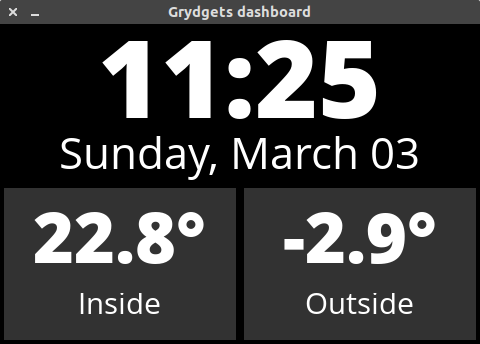

# Grydgets

Grydgets allows you to easily create widget-based dashboards that update in real time, showing local and online data.
It runs on anything that supports Python, PyGame, and SDL, from the oldest Raspberry Pi to a full-blown modern PC.



_Note:_ while the vast majority of the codebase was originally written by me, my free time has been dwindling more and more. Recent changes have been almost entirely developed with Claude Code. I have reviewed and tested the output, and I am using Grydgets myself 24/7.

## Installation

### From source (recommended for Raspberry Pi)

```bash
git clone https://github.com/iamjackg/grydgets
cd grydgets

# uv (recommended)
uv sync
uv run grydgets

# pip
python3 -m venv venv
venv/bin/pip install .
venv/bin/grydgets
```

To update an existing installation:

```bash
git pull
uv sync          # or: venv/bin/pip install .
```

`python main.py` still works as a shortcut if you prefer not to install the package.

### Docker (headless mode)

A Dockerfile and docker-compose configuration are provided for running Grydgets in headless mode.

1. Create a `data/` directory with your configuration files, fonts, and images:

```
data/
├── conf.yaml
├── widgets.yaml
├── providers.yaml
├── secrets.yaml          # optional
├── OpenSans-Regular.ttf  # fonts referenced in widgets.yaml
├── OpenSans-ExtraBold.ttf
└── images/               # images referenced in widgets.yaml
    └── weather/
```

2. Make sure `conf.yaml` has a file output configured (see [Outputs](#outputs)).

3. Start the container:

```bash
docker compose up -d
```

Rendered images will appear in `data/headless_output/`. The notification endpoint is exposed on port 5000.

### Command-line options

```
grydgets [--widgets FILE] [--theme FILE] [--config-dir DIR]
```

*   `--widgets` — Widget configuration file (default: `widgets.yaml`)
*   `--theme` — Theme file replacing the widgets file's `theme:` block, see [Theme files](#theme-files). Without it, the theme in the widgets file is used. Naming one theme for the whole run turns off [day/night switching](#day-and-night-themes) if `conf.yaml` configures it.
*   `--config-dir` — Directory containing config files, fonts, and images. All relative paths are resolved from this directory. Defaults to the current working directory.

`grydgets-client` displays a dashboard rendered on another machine. See
[Remote displays](#remote-displays).

## Configuration

### General Grydgets options (`conf.yaml`)

Configuration for Grydgets must be stored in a `conf.yaml` file in its main folder. A sample file is provided in the repo.

#### Render settings

```yaml
graphics:
  fps-limit: 10
  resolution: [480, 320]
  smooth-scaling: true
  flip: false
  text-scale: 1.0
logging:
  level: info
server:
  port: 5000
```

*   `fps-limit`: Maximum frames per second. Defaults to `60`.
*   `resolution`: Screen resolution as `[width, height]`.
*   `smooth-scaling` _(optional)_: Use bilinear filtering for image scaling (`true`, default) or faster nearest-neighbor (`false`). Set to `false` on low-power hardware like a Raspberry Pi 2.
*   `flip` _(optional)_: Rotate the output 180 degrees. Defaults to `false`.
*   `text-scale` _(optional)_: Multiplier applied to every text size written in `widgets.yaml`. Defaults to `1.0`, which changes nothing.

##### The HTTP server

The `server:` block configures the HTTP server but does not start it. Three
features start it:

| Feature | Endpoint it needs |
|---|---|
| A [notifiable widget](#http-notification-server) in `widgets.yaml` | `/notify` |
| A [`stream` output](#stream) | `/frame`, `/events` |
| [`appearance.http_control: true`](#day-and-night-themes) | `/theme` |

Day/night switching by the sun is a timer in the render loop and needs no
server. Without one of the three features above, Grydgets opens no port and the
`server:` block does nothing.

*   `host` _(optional)_: Address to bind. Defaults to `127.0.0.1`, which only
    this machine can reach. Set it to `0.0.0.0` or a LAN address if anything on
    another machine calls it — a [remote display](#remote-displays) fetching
    frames, or Home Assistant posting a notification. Grydgets logs the bind
    address at startup, and warns if it binds loopback while a stream output or
    notifiable widget is configured.
*   `port` _(optional)_: Defaults to `5000`.
*   `auth` _(optional)_: Two bearer tokens. `stream_token` covers `/frame` and
    `/events`, `control_token` covers `/notify` and `/theme`. Set either, both,
    or neither. An unset token leaves that scope open.

```yaml
server:
  host: 0.0.0.0
  port: 5000
  auth:
    stream_token: !secret stream_token
```

Send tokens in an `Authorization: Bearer <token>` header, not as a query
parameter — query parameters end up in access logs. A request missing a
required token gets a `401`.

Setting only `stream_token` is a reasonable starting point: nothing uses the
stream yet, while `/notify` is usually already wired into Home Assistant
automations that would all need editing. Be aware of what leaving `/notify`
open means. It fetches an image from a URL taken straight from the request
body, so anyone who can reach the port can make the dashboard display an
arbitrary address. Setting `control_token` closes that.

Endpoints check their feature on every request, so a hot reload can turn one on
or off. An endpoint whose feature is off returns `404`. Starting or stopping
the server itself needs a restart, and Grydgets warns if a reload would have
changed that.

##### Reading the same widgets file on two screens

Because `text_size` is a pixel count, the same value looks smaller on a denser
screen. `text-scale` lives in `conf.yaml`, which is already per-machine, so one
`widgets.yaml` can serve both. Set it to this screen's height divided by the
height the widgets were sized for — widgets written against 768 need `1.4` on a
1080p screen:

```yaml
graphics:
  resolution: [1920, 1080]
  text-scale: 1.4
```

Only `text_size` and a bar chart's `label_size` are scaled. A widget with no
`text_size` fits its text to its own cell, which already grew with the
resolution. `padding` and `corner_radius` are unaffected.

#### Day and night themes

An `appearance:` block names two [theme files](#theme-files) and the location
whose sunrise and sunset switch between them. Without it there is one theme, all
day.

```yaml
appearance:
  latitude: 45.12
  longitude: -75.34
  themes:
    day: themes/day.yaml
    night: themes/night.yaml
  offsets:
    sunrise: 0
    sunset: -30
```

*   `themes.day`, `themes.night`: Theme files, resolved from `--config-dir` like every other path. Both are loaded and checked at startup, so a mistake in the night theme is reported when you start the dashboard rather than at dusk.
*   `latitude`, `longitude` _(optional, but both or neither)_: Decimal degrees, north and east positive. Sunrise and sunset are worked out locally — nothing is fetched, and the dashboard switches on time with no network. Leave them out to switch only over [HTTP](#setting-the-theme).
*   `offsets` _(optional)_: Minutes to move each boundary, negative for earlier. Each applies to its own boundary only, so the example goes dark half an hour before sunset without also delaying the morning. Defaults to `0`.
*   `default` _(optional)_: Which theme a fresh start puts up, `day` or `night`. It stands until something changes it, and is also what gets used on a day the sun neither rises nor sets. Defaults to `day`.
*   `http_control` _(optional)_: Enables the [`/theme` endpoint](#setting-the-theme). Defaults to `false`. **This opens a port.** Switching by the sun does not.

Without coordinates the sun is never consulted and the
[`/theme` endpoint](#setting-the-theme) is the only thing that changes the
theme — for when something else should be deciding, such as a Home Assistant
automation watching a light sensor, or a presence rule. This needs
`http_control: true`. Without it nothing can switch the theme, and Grydgets
warns about that at startup:

```yaml
appearance:
  default: night
  http_control: true
  themes:
    day: themes/day.yaml
    night: themes/night.yaml
```

The coordinates only need to be roughly right — a degree is about four minutes
of sunset. At startup and on every switch the log says what the sun is doing,
which is the quickest way to check them:

```
Sun at 45.12,-75.34: day from 05:57 to 19:45 local (offsets +0/-30 min); night theme at 19:45
```

Switching rebuilds the widget tree with the other theme and leaves the
[providers](#providers) running, so widgets keep the data they already have
instead of blanking while they fetch it again. Above the polar circles, on a day
with no sunrise or sunset, whichever theme is up stays up.

The theme in use can be pinned or handed back to the sun at runtime over the
[notification server](#setting-the-theme), which is how to look at both themes
without waiting for dusk.

### Outputs

Grydgets uses a pluggable output system. You can configure one or more outputs to control where the rendered dashboard is displayed or sent. Add an `outputs` list to `conf.yaml`:

```yaml
outputs:
  - type: window
    fullscreen: true
```

If no `outputs` key is present, Grydgets falls back to legacy behavior based on the `graphics` and `headless` keys (see [Legacy Configuration](#legacy-configuration)).

**Rules:**
- At most one display output (`window` or `framebuffer`)
- Any number of non-display outputs (`file`, `post`, `stream`)
- At least one output is required
- If no display output is configured, SDL runs in dummy mode (no screen needed)

#### window

Displays the dashboard in an SDL window.

*   `fullscreen` _(optional)_: Run in fullscreen mode. Defaults to `false`.
*   `x_display` _(optional)_: X display to use (e.g. `":0"`). Only needed when starting via SSH.

```yaml
outputs:
  - type: window
    fullscreen: true
    x_display: ":0"
```

#### framebuffer

Renders directly to a Linux framebuffer device (e.g. SPI screens on Raspberry Pi).

*   `device`: Path to the framebuffer device (e.g. `"/dev/fb1"`).

```yaml
outputs:
  - type: framebuffer
    device: /dev/fb1
```

#### file

Saves rendered images to disk at regular intervals. Ideal for web dashboards, monitoring, or timelapse.

*   `output_path` _(optional)_: Directory for saved images. Defaults to `"./headless_output"`.
*   `render_interval` _(optional)_: Seconds between saves. Defaults to `60`.
*   `image_format` _(optional)_: `png`, `jpg`, `jpeg`, or `bmp`. Defaults to `"png"`.
*   `filename_pattern` _(optional)_: Pattern with `{timestamp}` and `{sequence}` placeholders. Defaults to `"grydgets_{timestamp}"`.
*   `keep_images` _(optional)_: Keep the last N images, deleting older ones. `0` = unlimited. Defaults to `100`.
*   `create_latest_symlink` _(optional)_: Create a `latest.{format}` symlink to the newest image. Defaults to `true`.

```yaml
outputs:
  - type: file
    output_path: "/var/www/html/dashboard"
    render_interval: 60
    image_format: png
    keep_images: 1440
```

#### post

Pushes the rendered image via HTTP POST to a remote endpoint. Works with any device or service that accepts image uploads — networked displays, smart signage, ingestion APIs, etc.

*   `url`: The endpoint to POST to.
*   `image_format` _(optional)_: `png`, `jpg`, `jpeg`, or `bmp`. Defaults to `"png"`.
*   `trigger` _(optional)_: When to push. `"on_dirty"` only pushes when content has changed. `"interval"` pushes on a fixed schedule regardless. Defaults to `"on_dirty"`.
*   `min_interval` _(optional)_: Minimum seconds between pushes. Defaults to `60`.
*   `auth` _(optional)_: Authentication. Supports `bearer` token or `basic` username/password.
*   `multipart` _(optional)_: Send the image as a `multipart/form-data` upload instead of raw bytes. Required for endpoints that expect a browser-style file upload.
    *   `field_name` _(optional)_: The form field name. Defaults to `"file"`.
    *   `filename` _(optional)_: The filename reported in the upload. Defaults to `image.<format>` (e.g. `image.jpeg`).
*   `after_post` _(optional)_: An additional HTTP request to fire after a successful upload. Useful for devices that require a separate "apply" or "display" call once the upload is complete.
    *   `url`: The URL to request.
    *   `method` _(optional)_: HTTP method. Defaults to `"GET"`.

By default the POST sends raw image bytes with the appropriate `Content-Type` header (`image/png`, `image/jpeg`, etc.). POSTs run in a background thread and will not block the main loop.

```yaml
outputs:
  - type: post
    url: https://display.local/image
    image_format: jpeg
    trigger: on_dirty
    min_interval: 300
    auth:
      bearer: !secret display_token
```

For devices that use a multipart file upload and require a separate call to display the image:

```yaml
outputs:
  - type: post
    url: http://display.local/doUpload?dir=/image/
    image_format: jpeg
    trigger: on_dirty
    min_interval: 60
    multipart:
      field_name: file
    after_post:
      url: http://display.local/set?img=/image/image.jpeg
```

#### stream

Keeps the latest frame in memory and serves it to
[remote displays](#remote-displays) over the [HTTP server](#the-http-server).
Adding this output starts the server. Frames come from the same port as
`/notify` and `/theme`.

*   `image_format` _(optional)_: `jpeg`, `jpg`, `png`, or `bmp`. Defaults to
    `"jpeg"`. JPEG quality is fixed by pygame and cannot be configured.
*   `debounce_ms` _(optional)_: How long the dashboard must stay still before
    Grydgets publishes a new frame. Defaults to `200`.

```yaml
outputs:
  - type: stream
    image_format: jpeg
    debounce_ms: 200
```

Frames are only pushed on changes, and Grydgets encodes nothing until it
publishes one, so an idle dashboard uses no CPU. Debouncing waits for the
dashboard to settle before pushing a new frame, so remote displays do not show
animations and only update once things stop moving.

Two endpoints:

```
GET /frame                        # the current frame, with an ETag
  ?width=1366&height=768          # optional: encode it at this size
  If-None-Match: "a1b2c3-1366x768"  # -> 304 if you already have that one
  X-Frame-Published-At: 1712...   # response header: when this frame was published
GET /events                       # text/event-stream, held open
  ?width=1366&height=768          # optional: logged, so you can see who is connected
  data: {"etag": "d4e5f6", "published_at": 1712...}   # one per published frame
  : ping                          # every 20 seconds
```

`width` and `height` are how a display asks for frames at its own resolution,
and `grydgets-client` sends its `graphics.resolution` on every request. Give
both or neither; a size outside 1-7680 or a missing half is a `400`. Without
them the frame comes back at the size the dashboard renders at.

Each size is scaled and encoded on first request and then held until the next
frame is published, so several screens sharing a resolution cost one encode
between them, and at most eight sizes are kept. The ETag names the frame and
the size together — the same frame at two sizes is two different downloads.
Asking for a frame you already have costs nothing: the `304` is answered from
the ETag without encoding anything. On `/events` the size is only logged.

The ETag is a hash of the frame's pixels. A re-render that produces identical
pixels keeps the same ETag, so clients get a `304` and do not repaint. `/frame`
returns `503` until the first frame is published, and `404` if no `stream`
output is configured.

`published_at` and `X-Frame-Published-At` are the same `time.time()`, taken
when the frame was published. `grydgets-client` uses it to measure how long it
took to notice, download, and display a frame -- see
[Latency](#latency-logging.level-debug). This only makes sense if the two
machines' clocks agree; nothing here synchronizes them.

```bash
curl -o frame.jpg http://dashboard-host:5000/frame
curl -N http://dashboard-host:5000/events
```

Each open `/events` connection holds a Werkzeug thread, so this suits a handful
of displays, not dozens.

#### Combining outputs

You can use multiple outputs simultaneously. For example, display on screen while also pushing to a remote display:

```yaml
outputs:
  - type: window
    fullscreen: true
  - type: post
    url: https://display.local/image
    image_format: jpeg
    trigger: on_dirty
    min_interval: 300
```

Or save to disk and push to a remote endpoint (no display needed):

```yaml
outputs:
  - type: file
    output_path: "./snapshots"
    render_interval: 300
  - type: post
    url: https://dashboard-api.example.com/ingest
    trigger: interval
    min_interval: 60
```

#### Legacy configuration

For backwards compatibility, Grydgets still accepts the old `graphics` display settings and `headless` key. These are automatically translated to the new output system:

*   `headless.enabled: true` becomes a `file` output
*   `graphics.fb-device` becomes a `framebuffer` output
*   Otherwise, a `window` output is created from `graphics.fullscreen`

If you add an `outputs` key, the legacy display settings (`fullscreen`, `fb-device`, `x-display`) and `headless` block are ignored.

**Important:** Switching between display and non-display modes requires restarting Grydgets. Configuration hot-reload (`SIGUSR1`) will warn and skip the change if the display mode changes.

### Remote displays

A screen can display a dashboard rendered on another machine. The rendering
machine runs Grydgets with a [`stream` output](#stream). Each screen runs
`grydgets-client`, which connects, fetches a new frame whenever one is
published, scales it and displays it. Screens build no widget tree, run no
providers, and need no fonts, images or `widgets.yaml`.

Use this when the screens are too slow to render the dashboard themselves.
Compositing a hundred widgets into a 1080p surface takes long enough on a
Raspberry Pi to delay a notification by seconds. A desktop does it cheaply and
can run a higher `fps-limit`.

```
     rendering host                        screens
  ┌────────────────────┐             ┌──────────────────┐
  │ grydgets           │   /events   │ grydgets-client  │
  │  widgets.yaml      │ ──────────► │  client.yaml     │
  │  providers.yaml    │   /frame    │   window or      │
  │  outputs: [stream] │ ◄────────── │   framebuffer    │
  └────────────────────┘             └──────────────────┘
```

#### On the rendering host

Add a `stream` output, bind the server to an address the screens can reach, and
raise `fps-limit`. Grydgets only picks up a notification on a render pass, so
`fps-limit` decides how late one can be.

```yaml
graphics:
  fps-limit: 10
  resolution: [1920, 1080]
server:
  host: 0.0.0.0
  port: 5000
  auth:
    stream_token: !secret stream_token
outputs:
  - type: stream
    image_format: jpeg
```

The rendering host needs no screen of its own; with no display output, SDL runs
in dummy mode. One process feeds every screen, at whatever size each one asks
for.

#### On each screen

```bash
uv run grydgets-client [--config FILE] [--config-dir DIR]
```

*   `--config` — Client configuration file (default: `client.yaml`)
*   `--config-dir` — Directory holding it. All relative paths resolve from here.

The client reads `client.yaml`, not `conf.yaml`. A sample is in
`client.yaml.sample`.

```yaml
server:
  url: http://dashboard-host:5000
  token: !secret stream_token   # only if the server sets stream_token
  reconnect_delay: 2
  stale_after: 30
graphics:
  resolution: [1366, 768]
indicator:
  corner: bottom-right
outputs:
  - type: window
    fullscreen: true
```

*   `server.url`: Base URL of the rendering host's HTTP server.
*   `server.token` _(optional)_: Must match the host's `server.auth.stream_token`.
*   `server.reconnect_delay` _(optional)_: Seconds before reconnecting after a dropped connection. Defaults to `2`.
*   `server.stale_after` _(optional)_: Seconds the connection must stay down before the warning triangle appears. Defaults to `30`.
*   `graphics.resolution`: This screen's resolution. Sent to the host with every request, so frames arrive already this size; anything that arrives at a different size is scaled to it here.
*   `logging.level` _(optional)_: `debug`, `info`, or `warning`. Defaults to `info`. `debug` also turns on the [latency overlay](#latency-logginglevel-debug).
*   `indicator.corner` _(optional)_: Where the warning triangle sits — `top-left`, `top-right`, `bottom-left`, `bottom-right`. Defaults to `bottom-right`.
*   `outputs`: Exactly one display output, `window` or `framebuffer`, configured the same way as [on the server](#window).

#### Sizing

Render once at your largest screen's resolution and let smaller screens scale
down. Rendering natively at a smaller resolution gives you a different layout,
not a smaller one: widgets auto-fit text to their own cell, so a dense widget
that reads fine at 1080p can turn into an unreadable run of digits at 768.

The scaling itself happens on the rendering host. Each client sends its
`graphics.resolution` with every request for a frame, and gets one encoded at
that size, so screens of different sizes can share one stream and none of them
scales anything. A client only falls back to scaling locally if the frame
arrives at some other size, which means the host is too old to understand the
request.

Both ends scale with `smoothscale`, whatever the server's
`graphics.smooth-scaling` says. That setting applies to `ImageWidget`, and
nearest-neighbour scaling breaks digit strokes at these ratios.

Scaling is where a weak screen spends its time, which is why it is worth moving.
A Raspberry Pi 1 taking a 1920x1080 JPEG down to 1366x768 spends roughly 420 ms
decoding, 140 ms converting and 570 ms scaling; receiving it at 1366x768 drops
all of that to about 290 ms, and the download with it. pygame only has a
vectorised `smoothscale` on x86 and on ARM with NEON -- an ARMv6 Pi runs the
plain C one, which `pygame.transform.get_smoothscale_backend()` reports as
`GENERIC`.

#### Latency (`logging.level: debug`)

Set `logging.level: debug` in `client.yaml` and every displayed frame gets a
small translucent panel in the top-left corner, plus a matching log line:

```
notice    42 ms
download  18 ms
display    6 ms
total     66 ms
```

*   **notice** — from the server publishing the frame to this client reading
    the `/events` line that announced it. Absent on the one frame fetched
    unconditionally at startup, since that fetch isn't a response to an event.
*   **download** — the `GET /frame` request itself.
*   **display** — from finishing the download to finishing the decode and
    scale, just before the frame is handed to the display output.
*   **total** — notice + download + display, i.e. wall clock from the server
    publishing to this client showing it.

All four come from comparing this client's clock to the `published_at`
timestamp the server put on the frame (see [`stream`](#stream)), so they are
only meaningful if the two machines' clocks agree.

#### When the connection drops

The client keeps displaying the last frame it received and reconnects every
`reconnect_delay` seconds. Once the connection has been down for `stale_after`
seconds, it draws an amber warning triangle in a corner so you can tell the
frame is old.

A rejected token draws the triangle immediately and backs the client off for
five minutes, since a bad token will not fix itself.

There is no local-render fallback. That would put the widget tree and providers
back on the screen, which defeats the point.

### Data Providers (`providers.yaml`)

Data providers allow you to fetch data in the background and share it across multiple widgets, eliminating redundant API calls. For example, if you have a widget for the weather forecast of each day of the week, a single provider can fetch all weather data once and make it available to all daily widgets.

Providers are configured in `providers.yaml`:

```yaml
providers:
  hass_calendar:
    type: rest
    url: !secret hass_calendar_url
    headers:
      Authorization: !secret hass_bearer_token
    json_path: "events"  # Extract this from response
    jq_expression: 'map(select(.status == "active"))'  # Further filter with jq
    update_interval: 60  # Fetch every 60 seconds
    jitter: 5  # Add random 0-5 second delay

  weather_api:
    type: rest
    url: https://api.weather.com/current
    method: GET
    auth:
      bearer: !secret weather_token
    update_interval: 300
```

#### Provider Configuration Options

*   `type`: Provider type. Currently only `rest` is supported.
*   `url`: The URL to fetch from (required).
*   `method` _(optional)_: HTTP method (`GET`, `POST`, `PUT`, `DELETE`). Defaults to `GET`.
*   `headers` _(optional)_: Dictionary of HTTP headers.
*   `params` _(optional)_: Dictionary of query parameters.
*   `body` or `payload` _(optional)_: Request body for POST/PUT requests.
*   `auth` _(optional)_: Authentication options (see [Authentication Schemes](#authentication-schemes)).
*   `json_path` _(optional)_: Simple JSON path to extract from response (e.g., `"events[0].title"`).
*   `jq_expression` _(optional)_: jq expression for complex data transformations (e.g., `'.events[] | select(.active)'`).
*   `update_interval` _(optional)_: Seconds between fetches. Defaults to `60`.
*   `jitter` _(optional)_: Random seconds (0 to this value) added to update interval. Defaults to `0`.

**Note:** If both `json_path` and `jq_expression` are provided, `json_path` is applied first, then `jq_expression` processes the result. This allows you to pre-filter data before complex transformations.

### Dashboard layout options (`widgets.yaml`)

The tree of widgets that composes your dashboard must be specified in a file called `widgets.yaml` in the main folder. A
sample file is included in the repository.

The top-level of your `widgets.yaml` defines options for the implicit main screen, which acts as a `ScreenWidget` container for your entire dashboard.

*   `background_image` _(optional)_: The path to an image file to use as the background for the entire screen. Takes precedence over `background_color`. Can be a theme token, see [Theming](#theming).
*   `background_color` _(optional)_: A color for the screen background, see [Colors](#colors). Used when there is no `background_image`. Defaults to `[0, 0, 0]` (black).
*   `drop_shadow` _(optional)_: If `true`, a drop shadow effect will be applied to the main content of the screen. Defaults to `false`.
*   `widgets`: A list containing the root widget(s) of your dashboard. Note that the `ScreenWidget` currently only supports a single child widget.
*   `theme` _(optional)_: Named values and per-widget defaults, see [Theming](#theming).

### Theming

A `theme:` block names values once so the rest of the file can refer to them,
and sets defaults so most widgets don't have to mention them at all.

```yaml
theme:
  colors:
    panel: '#3b4252'
    text: '#eceff4'
    text-muted: '#a3afc2'
  fonts:
    regular: fonts/Inter-400.ttf
    bold: fonts/Inter-800.ttf
  sizes:
    radius: 25

  groups:
    text-like: [text, rest, provider, providertemplate, notifiabletext, label]
  defaults:
    text-like:
      font_path: !font regular
      color: !color text
    grid:
      widget_background_color: !color panel
      widget_corner_radius: !size radius

widgets:
  - widget: grid
    children:
      - widget: text
        text: Kitchen              # font_path and color come from the theme
      - widget: text
        text: 21.4°
        color: !color text-muted   # a widget's own value always wins
```

#### Tokens

Every key of `theme` except `groups` and `defaults` is a **token section**, and
the section name is the YAML tag that reads from it: `!color panel` means
`theme.colors.panel`, `!font regular` means `theme.fonts.regular`. Sections are
yours to name — add a `spacings:` section and `!spacing tight` works. A tag
matches a section named either exactly (`color:`) or with a trailing `s`
(`colors:`).

A token can go anywhere a literal value can, including inside a mapping or list
parameter such as a grid's per-cell overrides:

```yaml
  - widget: grid
    widget_background_colors:
      alert-cell: !color danger
```

A theme entry may itself be a token (`panel-raised: !color panel`). Referring to
a name that isn't defined is an error at load time that names the section and
lists what it does define; so is a loop between entries.

The screen's own top-level keys take tokens too, which is how a theme changes
the background of the whole dashboard. `theme.defaults` can't reach them — the
screen isn't a node under `widgets:`, so there's nothing there to apply a
default to — which means the widgets file has to hand the keys over to the
theme by writing tokens on them:

```yaml
theme:
  colors:
    screen: '#1b1b1b'
  images:
    screen: images/background.jpg

background_image: !image screen
background_color: !color screen
```

A theme that wants a flat colour instead of wallpaper defines its `images.screen`
as `null`: the screen falls back to `background_color` whenever there's no image.
Since a [theme file](#theme-files) has to define everything the base theme does,
every theme has to say which of the two it wants — none of them can inherit the
wrong wallpaper by leaving the entry out.

```yaml
# themes/flat.yaml
colors:
  screen: '#f5f5f5'
images:
  screen: null
```

Tags rather than a `$panel`-style string because `widgets.yaml` is full of
scalars where a `$` is real content — jq expressions, Jinja templates, format
strings — and a tag can't collide with any of them.

#### Defaults

`theme.defaults` is keyed by widget type. Every widget of that type that doesn't
set the parameter itself gets it:

```yaml
  defaults:
    grid:
      widget_corner_radius: 25
```

Several widget types draw text without being a `text` widget — `rest`,
`provider` and the rest build one internally — so `theme.groups` lets you name a
set of types and give the whole set the same defaults:

```yaml
  groups:
    text-like: [text, rest, provider, providertemplate, notifiabletext, label]
  defaults:
    text-like:
      font_path: !font regular
```

Naming a widget type outright always beats a group it belongs to, whichever
order the two are written in. Note that `dateclock` (`time_font_path`,
`date_font_path`) and `providerbarchart` (`label_font_path`, `label_color`) use
their own parameter names and so need their own entries.

Defaults are resolved when the file is loaded and are never written back to it,
so `widgets.yaml` keeps saying only what you wrote. Two consequences worth
knowing: a widget that should *not* pick up a default has to override it
explicitly (`widget_corner_radius: 0`), and the same parameter name can mean
different things on different widgets — `color` is the text colour on `text`,
but the panel fill on `grid` and `empty` — which is why defaults are keyed by
type rather than applied to everything.

Tokens are only resolved in the widgets file. Using one in `conf.yaml` or
`providers.yaml` is an error.

#### Theme files

The `theme:` block in the widgets file is the base theme — the one that loads
when nothing else is said. `--theme FILE` replaces it with another, so the same
widget tree can be rendered with a different look without being edited:

```bash
grydgets --theme themes/light.yaml
```

A theme file's top level **is** the theme block: the same sections, `groups` and
`defaults` you would write under `theme:`, unindented by one level and with no
`theme:` key above them.

```yaml
# themes/light.yaml
colors:
  text: '#2e3440'
  panel: '#d8dee9'
fonts:
  regular: fonts/Inter-400.ttf
  bold: fonts/Inter-800.ttf
sizes:
  radius: 25

groups:
  text-like: [text, rest, provider, providertemplate, notifiabletext, label]
defaults:
  text-like:
    font_path: !font regular
    color: !color text
  grid:
    widget_corner_radius: !size radius
```

Replacement is total: nothing of the base theme is merged in, and tokens in an
override's own `defaults` resolve against that override. So a theme file has to
define **everything** the base theme does, `groups` and `defaults` included — a
file listing only colours would take the defaults away with it and leave the
text widgets with no font. Loading one that's incomplete is an error naming the
entries it's missing, rather than a failure later on inside a widget. Defining
*more* than the base is fine.

Relative paths inside a theme file are resolved like any other, from
`--config-dir`. The file is re-read on [reload](#hot-reload), so editing a theme
and sending `SIGUSR1` shows it without a restart.

Two theme files can be named in `conf.yaml` instead of one on the command line,
and the dashboard moves between them at sunrise and sunset — see
[Day and night themes](#day-and-night-themes).

The [widget editor](#widget-editor) knows nothing about `--theme`: it reads and
writes the base theme in the widgets file, and a document edited while an
override is loaded still shows the base theme's values.

## Widgets

Grydgets, as the name suggests, draws dashboards based on a series of _widgets_. Widgets are generally of two types:
Normal and Container.

**Normal widgets** draw something specific on the screen: a clock, the result of a REST call, an image, etc.

**Container widgets** determine where and how other widgets appear. For example, a Grid widget allows you to lay other
widgets out in a grid. They can also affect their appearance, for example by adding a label below or above another
widget.

### General Widget Parameters

Most widgets support the following optional parameters:

*   `name` _(optional)_: A unique name for the widget instance. This is used for logging and for identifying notifiable widgets. If not provided, the widget type name is used.

### Colors

Every parameter documented below as a color accepts either of two forms, and
they're interchangeable everywhere — including the top-level `background_color`
and the nested chart parameters such as `bar_colors` and `bar_color_thresholds`.

**A list of RGB or RGBA components**, each `0`-`255`:

```yaml
color: [255, 136, 0]
color: [255, 136, 0, 204]   # with alpha
```

**A CSS-style string**:

| Form | Example | Meaning |
|---|---|---|
| `#rrggbb` | `'#ff8800'` | opaque |
| `#rrggbbaa` | `'#ff8800cc'` | with alpha |
| `#rgb` | `'#f80'` | shorthand for `#ff8800` |
| `#rgba` | `'#f80c'` | shorthand for `#ff8800cc` |
| color name | `'orange'` | any [CSS color name](https://www.w3.org/TR/css-color-3/#svg-color) |

Quote hex strings in YAML — an unquoted `#` starts a comment. A color parameter
also accepts a theme token (`color: !color accent`), see [Theming](#theming).

```yaml
  - widget: dateclock
    time_color: '#eceff4'
    date_color: '#8fbcbb'
    background_color: '#000000a0'
```

A color that can't be parsed is an error at load time, naming the parameter it
came from, rather than a silent fallback. The one exception is a color sent to
a `notifiabletext` widget over the [notification server](#http-notification-server):
that arrives at runtime from an outside caller, so a bad value is logged and
ignored instead of interrupting the dashboard.

#### Naming

Two names mean the same thing wherever they appear:

*   `color` — the widget's own content: text, a bar, the fill of an `empty`.
*   `background_color` — what's painted behind that content.

Anything more specific is prefixed with what it applies to (`time_color`,
`pill_background_color`, `widget_background_color`).

Three parameters were renamed to fit this. The old names still load, with a
warning naming the replacement, so existing files keep working:

| Widget | Old name | New name |
|---|---|---|
| `grid` | `color` | `background_color` |
| `grid` | `widget_color` | `widget_background_color` |
| `label` | `text_color` | `color` |

If both names are given, the new one wins.

### Authentication Schemes

Widgets that make HTTP requests (e.g., `rest`, `restimage`, `httpflip`) often support an `auth` parameter. This is a dictionary specifying the authentication method:

*   `bearer`: A string representing a Bearer token.
*   `basic`: An object containing `username` and `password` strings for Basic authentication.

Example `auth` configuration:

```yaml
auth:
  bearer: !secret my_bearer_token
# OR
auth:
  basic:
    username: myuser
    password: mypassword
```

### Container widgets

All Container widgets take a `children` parameter, specifying the list of widgets they're going to contain.

#### grid

A widget that allows you to place other widgets in a grid layout.

It supports the following parameters:

*   `rows`: The number of rows in the grid.
*   `columns`: The number of columns in the grid.
*   `padding` _(optional)_: The amount of padding around each child widget, in pixels. Defaults to `0`.
*   `background_color` _(optional)_: A background color for the grid itself (the "empty" space between widgets or behind the entire grid), see [Colors](#colors). Was called `color`.
*   `widget_background_color` _(optional)_: A background color for each *child widget's cell*, see [Colors](#colors). Was called `widget_color`.
*   `widget_background_colors` _(optional)_: Per-cell background colors, overriding `widget_background_color` for the cells they name. See [Per-cell overrides](#per-cell-overrides).
*   `corner_radius` _(optional)_: The corner radius for the overall grid background, in pixels. Defaults to `0`.
*   `widget_corner_radius` _(optional)_: The corner radius for each child widget's background, in pixels. Defaults to `0`.
*   `widget_corner_radii` _(optional)_: Per-cell corner radii, overriding `widget_corner_radius` for the cells they name. See [Per-cell overrides](#per-cell-overrides).
*   `image_path` _(optional)_: The path to an image file to use as the background for the entire grid.
*   `drop_shadow` _(optional)_: If `true`, a drop shadow effect will be applied to the child widgets within the grid. Defaults to `false`.
*   `row_ratios` _(optional)_: A list representing the relative ratio of each row's height. E.g., `[1, 2]` means the second row will be twice as tall as the first. If not provided, rows have equal height.
*   `column_ratios` _(optional)_: A list representing the relative ratio of each column's width. E.g., `[1, 2]` means the second column will be twice as wide as the first. If not provided, columns have equal width.

Example:

```yaml
  - widget: grid
    rows: 2
    columns: 2
    padding: 4
    background_color: [50, 50, 50]
    widget_background_color: [70, 70, 70, 180]
    corner_radius: 10
    widget_corner_radius: 5
    row_ratios: [1, 2]
    column_ratios: [1, 2]
```

##### Per-cell overrides

`widget_background_colors` and `widget_corner_radii` take either a mapping keyed
on a child's `name`, or a list positional to the children. Cells they don't
mention keep the grid-wide `widget_background_color` / `widget_corner_radius`.

```yaml
  - widget: grid
    rows: 1
    columns: 3
    widget_background_color: "#2e3440"   # the default for every cell
    widget_background_colors:
      alert-tile: "#bf616a"              # ...except this one
    children:
      - widget: text
        name: alert-tile
        text: 'Alert'
      - widget: text
        text: 'Normal'
      - widget: text
        text: 'Normal'
```

The list form is positional, and `null` means "leave this one alone":

```yaml
    widget_background_colors: ["#bf616a", null, "#a3be8c"]
```

Keys in the mapping form match a child's `name`, so only children that set one
can be targeted — a widget with no `name` is named after its class, which would
match every other unnamed widget of the same type.

#### label

A widget that lets you add a text label above or below another widget. It can only have one child.

It supports the following parameters:

*   `text`: The text to display as the label.
*   `font_path` _(optional)_: The path to a ttf file to use as font for the label text.
*   `position` _(optional)_: `above` or `below` the child widget. Defaults to `above`.
*   `text_size` _(optional)_: The size of the label text in pixels.
*   `color` _(optional)_: The color of the label text, see [Colors](#colors). Defaults to `[255, 255, 255]` (white). Was called `text_color`.

Example:

```yaml
  - widget: label
    text: 'Random person'
    position: below
    text_size: 30
    color: [255, 255, 0]
    children:
      - widget: rest # ... some child widget
```

#### flip

A widget that will transition between each child widget at a specified interval, with custom easing and
transition time.

It supports the following parameters:

*   `interval` _(optional)_: How long to wait before switching to the following widget, in seconds. Defaults to `5` seconds.
*   `transition` _(optional)_: How long the animation for transitioning to the following widget should last, in seconds. Defaults to `1` second.
*   `ease` _(optional)_: Determines the ease factor of the transition animation. Higher values make the transition more abrupt at the beginning/end. Defaults to `2`.

Example:

```yaml
  - widget: flip
    interval: 5
    transition: 1
    ease: 3
    children:
      - widget: text # first child
      - widget: restimage # second child
```

#### httpflip

A specialized `flip` widget that determines which child widget to display based on an HTTP request response.

It supports the following parameters:

*   `url`: The URL to retrieve the value from.
*   `mapping`: A dictionary where keys are expected response values (or extracted JSON paths) and values are the `name` of the child widget to display.
*   `default_widget`: The `name` of the child widget to display if the response value does not match any entry in `mapping`.
*   `json_path` _(optional)_: The path to the json item to extract from the HTTP response. If not provided, the raw response text is used.
*   `jq_expression` _(optional)_: jq expression to extract the comparison value from the JSON response. If both `json_path` and `jq_expression` are provided, `json_path` is applied first.
*   `auth` _(optional)_: Authentication options (see [Authentication Schemes](#authentication-schemes)).
*   `method` _(optional)_: The HTTP method to use (`GET` or `POST`). Defaults to `GET`.
*   `payload` _(optional)_: A dictionary representing the JSON payload for `POST` requests.
*   `update_frequency` _(optional)_: How often the HTTP request should be made, in seconds. Defaults to `30` seconds.
*   `static` _(optional)_: If `true`, the HTTP request is made only once on startup and never repeated. Useful when the mapped value is known to be fixed. Defaults to `false`.

**Inherited from `flip` widget:**
*   `interval` _(optional)_: How long to wait before checking for changes, in seconds. Defaults to `5` seconds.
*   `transition` _(optional)_: How long the animation for transitioning should last, in seconds. Defaults to `1` second.
*   `ease` _(optional)_: Determines the ease factor of the transition animation. Higher values make the transition more abrupt at the beginning/end. Defaults to `2`.

Example:

```yaml
  - widget: httpflip
    default_widget: motioneye-cam
    update_frequency: 60
    url: "https://homeassistant.example.com/api/template"
    method: POST
    auth:
      bearer: !secret hass_token
    payload:
      template: '{{ (now() > today_at("18:00")) and (now() - states.switch.sonoff_meter_plug_4_relay.last_changed).seconds < (60*60*2) }}'
    mapping:
      "False": main-cam
      "True": other-cam
    children:
      - widget: restimage
        name: main-cam
        url: http://192.168.255.34/image.jpg
      - widget: restimage
        name: other-cam
        url: 'https://motioneye.example.com/picture/13/current'
```

#### scheduleflip

A specialized `flip` widget that determines which child widget to display based on a time schedule. It inherits all parameters from `flip` widgets.

It supports the following parameters:

*   `schedule`: A dictionary mapping time strings (`HH:MM` format) to the `name` of the child widget to display at or after that time, until the next scheduled time.
*   `interval` _(optional)_: How long to wait before checking the schedule again, in seconds. Defaults to `5` seconds.
*   `transition` _(optional)_: How long the animation for transitioning to the following widget should last, in seconds. Defaults to `1` second.
*   `ease` _(optional)_: Determines the ease factor of the transition animation. Defaults to `2`.

Example:

```yaml
  - widget: scheduleflip
    schedule:
      "08:00": morning-widget
      "18:00": evening-widget
    children:
      - widget: text
        name: morning-widget
        text: "Good Morning!"
      - widget: text
        name: evening-widget
        text: "Good Evening!"
```

#### pill

A specialized container widget that superimposes a pill-shaped overlay on top of a base widget. Useful for adding badges, status indicators, or additional information overlays on images or complex widgets.

It supports the following parameters:

*   `circular_mask` _(optional)_: If `true`, applies a circular mask to the base (first) widget. Defaults to `false`.
*   `widget_background_color` _(optional)_: Background color for the masked widget when using circular mask. See [Colors](#colors).
*   `pill_background_color` _(optional)_: Background color for the pill overlay. See [Colors](#colors). Defaults to transparent.
*   `pill_width_percent` _(optional)_: Width of the pill as a percentage of container width (0.0-1.0). Defaults to `0.8`.
*   `pill_height_percent` _(optional)_: Height of the pill as a percentage of container height (0.0-1.0). Defaults to `0.2`.
*   `pill_position_x` _(optional)_: Horizontal center position of the pill (0.0-1.0). Defaults to `0.5` (centered).
*   `pill_position_y` _(optional)_: Vertical center position of the pill (0.0-1.0). Defaults to `0.8` (lower area).
*   `pill_corner_radius` _(optional)_: Corner radius for the pill shape in pixels. If not specified, the pill is fully rounded (semicircular ends).
*   `pill_size_relative_to_circle` _(optional)_: If `true` and `circular_mask` is enabled, the pill size is relative to the circle diameter. Defaults to `false`.
*   `children`: Exactly 2 child widgets. First is the base widget, second is the overlay widget.

Example:

```yaml
  - widget: pill
    circular_mask: true
    widget_background_color: [40, 0, 40, 150]
    pill_background_color: [0, 0, 0, 150]
    pill_width_percent: 1.4
    pill_height_percent: 0.25
    pill_position_y: 0.85
    pill_size_relative_to_circle: true
    children:
      - widget: restimage
        url: "file://images/profile.png"
        preserve_aspect_ratio: true
      - widget: text
        text: "Online"
        font_path: 'OpenSans-Regular.ttf'
        color: [0, 255, 0]
        align: center
```

#### notifiabletext

A container widget that can display a temporary text notification over its main child widget. It can only have one child.

It supports the following parameters:

*   `font_path`: The path to a ttf file to use as font for the notification text.
*   `padding` _(optional)_: The amount of padding around the notification text in pixels. Defaults to `0`.
*   `text_size` _(optional)_: The size of the notification text in pixels.
*   `color` _(optional)_: The default color of the notification text, see [Colors](#colors). Defaults to `[255, 255, 255]` (white).
*   `background_color` _(optional)_: The default background color behind the notification, see [Colors](#colors). Unset by default, so the notification text appears over whatever is behind it.
*   `corner_radius` _(optional)_: The corner radius for `background_color`, in pixels. Defaults to `0`.

To send a notification, send a POST HTTP request to the port configured in `conf.yaml`.

The POST body takes `widget`, `text`, and optionally `duration`, `color`, and
`background_color`. `color` and `background_color` override the widget's
configured values for that one notification — leave them out and the
notification uses the configured look, so an alert that asked for a red
backdrop doesn't tint the next one. A colour the parser rejects is logged and
ignored rather than being allowed to interrupt rendering.

Example:

```yaml
  - widget: notifiabletext
    name: fullscreen-notification
    font_path: 'OpenSans-ExtraBold.ttf'
    padding: 10
    text_size: 100
    children:
      - widget: grid # ... main content widget
```

```bash
curl -X POST \
     -H "Content-Type: application/json" \
     -d '{"widget": "fullscreen-notification", "text": "This is a test notification from curl!", "duration": 10}' \
     http://192.168.1.1:5000/notify
```

An alert with its own colours:

```bash
curl -X POST \
     -H "Content-Type: application/json" \
     -d '{"widget": "fullscreen-notification", "text": "Doorbell", "color": "#ffffff", "background_color": "#bf616a", "duration": 15}' \
     http://192.168.1.1:5000/notify
```


#### notifiableimage

A container widget that can display a temporary image notification over its main child widget. It can only have one child.

It supports the following parameters:

*   No specific configuration parameters beyond the common `name`.

TTo send a notification, send a POST HTTP request to the port configured in `conf.yaml` with `url` (of the image) and `duration` (optional, in seconds).

Example:

```yaml
  - widget: notifiableimage
    name: fullscreen-notification-image
    children:
      - widget: notifiabletext # ... main content widget (which itself could be notifiable)
```

```bash
curl -X POST \
     -H "Content-Type: application/json" \
     -d '{"widget": "fullscreen-notification-image", "url": "https://example.com/your_image.jpg"}' \
     http://192.168.1.1:5000/notify
```


### Normal widgets

#### text

A simple widget that displays some text.

It supports the following parameters:

*   `text` _(optional)_: The text to display. Defaults to an empty string `''`.
*   `text_size` _(optional)_: The size of the text in pixels. If not provided, it automatically adjusts to fit the widget's height.
*   `font_path` _(optional)_: The path to a ttf file to use as font. If not provided, Pygame's default font is used.
*   `color` _(optional)_: The color of the text, see [Colors](#colors). Defaults to `[255, 255, 255]` (white).
*   `background_color` _(optional)_: A background color painted behind the text, see [Colors](#colors). Covers the whole widget — `padding` insets the text, not the backdrop. Unset by default, leaving the widget transparent.
*   `corner_radius` _(optional)_: The corner radius for `background_color`, in pixels. Defaults to `0`.
*   `padding` _(optional)_: The amount of padding around the text in pixels. Defaults to `0`.
*   `align` _(optional)_: The horizontal alignment for the text. One of `left`, `center`, or `right`. Defaults to `left`.
*   `vertical_align` _(optional)_: The vertical alignment for the text. One of `top`, `center`, or `bottom`. Defaults to `top`.

Example:

```yaml
  - widget: text
    text: 'Hello Grydgets!'
    text_size: 50
    font_path: 'OpenSans-Regular.ttf'
    color: [0, 255, 0]
    background_color: "#2e3440"
    corner_radius: 12
    align: center
    vertical_align: center
```

Giving a text widget its own `background_color` is an alternative to wrapping it
in a `grid` just to get `widget_background_color` — one fewer level of nesting
for a single tile.

#### dateclock

A widget that displays a 24-hour clock at the top, and the current date at the bottom.

It supports the following parameters:

*   `time_font_path`: The path to a ttf file to use as font for the time.
*   `date_font_path`: The path to a ttf file to use as font for the date.
*   `color` _(optional)_: The color of the time and date text, see [Colors](#colors). Defaults to `[255, 255, 255]` (white).
*   `time_color` _(optional)_: The color of the time only. Overrides `color` for the time line.
*   `date_color` _(optional)_: The color of the date only. Overrides `color` for the date line.
*   `background_color` _(optional)_: The background color for the clock widget, see [Colors](#colors).
*   `corner_radius` _(optional)_: The corner radius for the clock widget's background, in pixels. Defaults to `0`.

The time and date are separate lines, so they can each take their own font and
their own color — useful for pairing a display face on the time with a plainer
one on the date.

Example:

```yaml
  - widget: dateclock
    time_font_path: 'fonts/Fraunces-700.ttf'
    date_font_path: 'fonts/Inter-400.ttf'
    time_color: [236, 239, 244]
    date_color: [143, 188, 187]
    background_color: [0, 0, 0, 160]
    corner_radius: 25
```

#### rest

A widget that makes periodic HTTP requests and displays the response text. It supports JSON extraction and custom formatting of the final text.

It supports the following parameters:

*   `url`: The URL to retrieve.
*   `json_path` _(optional)_: The path to the JSON item to extract from the HTTP response. Supports nested objects and array indexing (e.g., `address.city` or `items[0].name`).
*   `jq_expression` _(optional)_: jq expression for complex data transformations (e.g., `.items[] | select(.active)`). If both `json_path` and `jq_expression` are provided, `json_path` is applied first.
*   `format_string` _(optional)_: A Python format string to be used to format the final text. The extracted value is passed as the first argument. Defaults to `{}`.
*   `method` _(optional)_: The HTTP method to use (`GET` or `POST`). Defaults to `GET`.
*   `payload` _(optional)_: A dictionary representing the JSON payload for `POST` requests.
*   `auth` _(optional)_: Authentication options (see [Authentication Schemes](#authentication-schemes)).
*   `update_frequency` _(optional)_: How often the HTTP request should be made, in seconds. Defaults to `30` seconds.
*   `static` _(optional)_: If `true`, the HTTP request is made only once on startup and never repeated. Useful when displaying a fixed value. Defaults to `false`.
*   `font_path` _(optional)_: The path to a ttf file to use as font. If not provided, Pygame's default font is used.
*   `text_size` _(optional)_: The size of the text in pixels. If not provided, it automatically adjusts to fit the widget's height.
*   `color` _(optional)_: The color of the text, see [Colors](#colors). Defaults to `[255, 255, 255]` (white).
*   `background_color` _(optional)_: A background color painted behind the text, see [Colors](#colors). Covers the whole widget — `padding` insets the text, not the backdrop. Unset by default, leaving the widget transparent.
*   `corner_radius` _(optional)_: The corner radius for `background_color`, in pixels. Defaults to `0`.
*   `padding` _(optional)_: The amount of padding around the text in pixels. Defaults to `6`.
*   `align` _(optional)_: The horizontal alignment for the text. One of `left`, `center`, or `right`. Defaults to `center`.
*   `vertical_align` _(optional)_: The vertical alignment for the text. One of `top`, `center`, or `bottom`. Defaults to `center`.

Example:

```yaml
  - widget: rest
    url: 'https://jsonplaceholder.typicode.com/users/1'
    json_path: 'address.city'
    format_string: 'lives in {}'
    text_size: 70
    update_frequency: 60
    auth:
      bearer: !secret my_api_token
    method: GET
```

#### provider

A widget that displays data from a configured data provider. Unlike `rest` widgets that make their own HTTP requests, provider widgets read from shared data providers defined in `providers.yaml`, allowing multiple widgets to efficiently share the same data source.

It supports the following parameters:

*   `providers`: A list containing exactly one provider name (e.g., `[hass_calendar]`).
*   `data_path` _(optional)_: JSON path to extract from provider data.
*   `jq_expression` _(optional)_: jq expression to extract/transform provider data. If both are provided, `data_path` is applied first.
*   `format_string` _(optional)_: Python format string for display. The value is passed as `{value}`. Defaults to `"{value}"`.
*   `fallback_text` _(optional)_: Text to show on error or missing data. Defaults to `"--"`.
*   `show_errors` _(optional)_: If `true`, displays error messages instead of fallback text. Defaults to `false`.
*   `font_path` _(optional)_: Path to a ttf font file.
*   `text_size` _(optional)_: Text size in pixels.
*   `color` _(optional)_: The color of the text, see [Colors](#colors). Defaults to `[255, 255, 255]` (white).
*   `background_color` _(optional)_: A background color painted behind the text, see [Colors](#colors). Covers the whole widget — `padding` insets the text, not the backdrop. Unset by default, leaving the widget transparent.
*   `corner_radius` _(optional)_: The corner radius for `background_color`, in pixels. Defaults to `0`.
*   `padding` _(optional)_: The amount of padding around the text in pixels. Defaults to `6`.
*   `align` _(optional)_: The horizontal alignment for the text. One of `left`, `center`, or `right`. Defaults to `center`.
*   `vertical_align` _(optional)_: Vertical alignment (`top`, `center`, `bottom`). Defaults to `center`.

Example:

```yaml
providers:
  my_calendar:
    type: rest
    url: !secret calendar_api
    update_interval: 60

widgets:
  - widget: grid
    rows: 3
    children:
      - widget: provider
        providers: [my_calendar]
        data_path: "[0].title"
        fallback_text: "No events"
      - widget: provider
        providers: [my_calendar]
        data_path: "[0].location"
      - widget: provider
        providers: [my_calendar]
        jq_expression: '.[0].start | strptime("%Y-%m-%d") | strftime("%A")'
```

#### providertemplate

A widget that renders data from providers using Home Assistant's Jinja2 template engine. This is useful for complex formatting that leverages Home Assistant's powerful template functions and filters.

It supports the following parameters:

*   `providers`: A list of provider names (can be multiple, e.g., `[calendar, weather]`).
*   `template`: Jinja2 template string. Each provider's data is available as `provider_<name>` (e.g., `provider_calendar`, `provider_weather`).
*   `hass_url`: Home Assistant instance URL (required).
*   `hass_token`: Home Assistant authentication token (required).
*   `fallback_text` _(optional)_: Text to show on error. Defaults to `"--"`.
*   `font_path` _(optional)_: Path to a ttf font file.
*   `text_size` _(optional)_: Text size in pixels.
*   `color` _(optional)_: The color of the text, see [Colors](#colors). Defaults to `[255, 255, 255]` (white).
*   `background_color` _(optional)_: A background color painted behind the text, see [Colors](#colors). Covers the whole widget — `padding` insets the text, not the backdrop. Unset by default, leaving the widget transparent.
*   `corner_radius` _(optional)_: The corner radius for `background_color`, in pixels. Defaults to `0`.
*   `padding` _(optional)_: The amount of padding around the text in pixels. Defaults to `6`.
*   `align` _(optional)_: The horizontal alignment for the text. One of `left`, `center`, or `right`. Defaults to `center`.
*   `vertical_align` _(optional)_: Vertical alignment. Defaults to `center`.

Example:

```yaml
- widget: providertemplate
  providers: [hass_calendar, weather_api]
  hass_url: !secret hass_url
  hass_token: !secret hass_token
  template: |
    
    
    {{ event.title }} at {{ event.start_time | as_timestamp | timestamp_custom('%I:%M %p') }}
    Weather: {{ weather.temp }}°F
  fallback_text: "Loading..."
```

#### providerflip

A specialized flip widget that conditionally displays child widgets based on data from a provider. Similar to `httpflip`, but reads from a shared provider instead of making its own HTTP requests.

It supports the following parameters:

*   `providers`: A list containing exactly one provider name.
*   `data_path` _(optional)_: JSON path to extract the comparison value from provider data.
*   `jq_expression` _(optional)_: jq expression to extract the comparison value.
*   `mapping`: Dictionary mapping values to child widget names.
*   `default_widget`: Name of the child widget to display by default or when no mapping matches.
*   `interval` _(optional)_: How often to check the provider for data changes, in seconds. Defaults to `5` seconds.
*   `transition` _(optional)_: Transition animation duration in seconds. Defaults to `1`.
*   `ease` _(optional)_: Easing factor for transition. Defaults to `2`.

On provider errors, the widget stays on the currently displayed child (does not switch).

Example:

```yaml
providers:
  camera_switch:
    type: rest
    url: https://homeassistant.example.com/api/template
    method: POST
    auth:
      bearer: !secret hass_token
    payload:
      template: '{{ is_state("switch.camera_mode", "on") }}'
    update_interval: 10

widgets:
  - widget: providerflip
    providers: [camera_switch]
    default_widget: cam_a
    transition: 0.5
    mapping:
      "True": cam_a
      "False": cam_b
    children:
      - widget: restimage
        name: cam_a
        url: http://192.168.1.10/image.jpg
      - widget: restimage
        name: cam_b
        url: http://192.168.1.11/image.jpg
```

#### providerimage

A widget that displays images from URLs contained in provider data. Similar to `restimage`, but reads the image URL from a provider. Supports both HTTP/HTTPS URLs and local file paths using the `file://` protocol.

It supports the following parameters:

*   `providers`: A list containing exactly one provider name.
*   `data_path` _(optional)_: JSON path to extract the image URL from provider data.
*   `jq_expression` _(optional)_: jq expression to extract the image URL.
*   `fallback_image` _(optional)_: Path to a fallback image file to display on error.
*   `auth` _(optional)_: Authentication for fetching the image from HTTP/HTTPS URLs (not used for `file://` URLs).
*   `preserve_aspect_ratio` _(optional)_: If `true`, maintains the original image aspect ratio when scaling. If `false` (default), the image is scaled to fill the container.
*   `show_errors` _(optional)_: If `true`, displays error messages instead of a fallback image. Defaults to `false`.

The extracted URL can be:
- HTTP/HTTPS URL: `https://example.com/image.jpg`
- Local file path: `file:///path/to/image.jpg`

Example:

```yaml
providers:
  camera_urls:
    type: rest
    url: https://api.example.com/cameras
    json_path: "active_cameras"
    update_interval: 30

widgets:
  - widget: providerimage
    providers: [camera_urls]
    data_path: "[0].image_url"
    fallback_image: "camera_offline.png"

  # Example with file:// URLs
  - widget: providerimage
    providers: [local_images]
    data_path: "current_image"
    # Provider returns: {"current_image": "file:///home/user/images/photo.jpg"}
```

#### restimage

A widget that makes periodic HTTP requests and displays the retrieved image file. It also supports extracting an image URL from a JSON response and retrieving that image. Supports both HTTP/HTTPS URLs and local file paths using the `file://` protocol.

It supports the following parameters:

*   `url`: The URL to retrieve the image from (HTTP/HTTPS or `file://` URL).
*   `json_path` _(optional)_: The path to the JSON item that contains an image URL to retrieve. If specified, the value at this path will be used as the actual image URL.
*   `jq_expression` _(optional)_: jq expression to extract the image URL from the JSON response. If both `json_path` and `jq_expression` are provided, `json_path` is applied first.
*   `auth` _(optional)_: Authentication options for HTTP/HTTPS requests (see [Authentication Schemes](#authentication-schemes)). Not used for `file://` URLs.
*   `update_frequency` _(optional)_: How often the image should be refreshed, in seconds. Defaults to `30` seconds.
*   `static` _(optional)_: If `true`, the image is loaded only once on startup and never re-fetched. Useful for local files or remote images that never change. Defaults to `false`.
*   `preserve_aspect_ratio` _(optional)_: If `true`, maintains the original image aspect ratio when scaling. If `false` (default), the image is scaled to fill the container.

The URL (either directly specified or extracted via `json_path`/`jq_expression`) can be:
- HTTP/HTTPS URL: `https://example.com/image.jpg`
- Local file path: `file:///path/to/image.jpg`

Examples:

```yaml
  # HTTP image
  - widget: restimage
    url: 'https://motioneye.example.com/picture/9/current/'
    auth:
      basic:
        username: camera_user
        password: camera_password
    update_frequency: 10

  # Local file
  - widget: restimage
    url: 'file:///home/user/images/current.jpg'
    update_frequency: 5

  # Extract URL from JSON (can return either HTTP or file:// URL)
  - widget: restimage
    url: 'https://api.example.com/current-image'
    json_path: 'image_url'
    update_frequency: 10
```

#### image

A widget that displays a static image. Currently only accepts binary image data loaded from external code. This widget is primarily used internally by other widgets like `NotifiableImageWidget`, but can be directly configured with `image_data` (though this typically requires dynamic injection).

It supports the following parameters:

*   `image_data` _(optional)_: Binary contents of the image to display. (Typically set dynamically)
*   `preserve_aspect_ratio` _(optional)_: If `true`, maintains the original image aspect ratio when scaling. If `false` (default), the image is scaled to fill the container.

#### empty

A widget that draws nothing but the space it occupies. Use it to leave a hole in
a grid, or — with a `color` — as a divider, rule, or plain colour swatch without
wrapping anything in a `grid` to get a background.

It supports the following parameters:

*   `color` _(optional)_: The color to fill the widget with, see [Colors](#colors). Unset by default, leaving the widget fully transparent.
*   `corner_radius` _(optional)_: The corner radius for `color`, in pixels. Defaults to `0`.

Example:

```yaml
  # A 2px rule between two rows
  - widget: empty
    color: [255, 255, 255, 40]
```

#### providerbarchart

A widget that renders a bar chart from a list of numeric values sourced from a data provider. Designed to be minimal — no axes or legend — and efficient enough for low-power hardware like the Raspberry Pi.

It supports the following parameters:

*   `providers`: A list containing exactly one provider name.
*   `data_path` _(optional)_: JSON path to extract the list of values from provider data.
*   `jq_expression` _(optional)_: jq expression that must return a JSON array of numbers.
*   `bar_color` _(optional)_: Default color of the bars, see [Colors](#colors). Defaults to `[100, 149, 237]` (cornflower blue).
*   `bar_colors` _(optional)_: A mapping of label strings to colors (see [Colors](#colors)). Bars whose label matches a key are drawn in the corresponding color, taking priority over `bar_color_thresholds` and `bar_color`.
*   `bar_color_thresholds` _(optional)_: A list of `{above: <value>, color: <color>}` entries (see [Colors](#colors)). Each bar is colored by the first threshold whose `above` value is less than or equal to the bar's value. Checked in descending order. Falls back to `bar_color` if no threshold matches.
*   `bar_background_colors` _(optional)_: A mapping of label strings to colors (see [Colors](#colors)). Draws a full-height background rectangle behind the matching bar. Useful as a visual demarcator — visible even when the bar value is zero.
*   `bar_gap` _(optional)_: Gap between bars in pixels. Defaults to `2`.
*   `max_value` _(optional)_: Fixed maximum value for the chart. If not provided, auto-scales to the maximum value in the data.
*   `min_value` _(optional)_: Minimum value for the chart. Defaults to `0`.
*   `midline` _(optional)_: If `true`, draws a horizontal marker line at the 50% point behind the bars. Defaults to `false`.
*   `midline_thickness` _(optional)_: Thickness of the midline in pixels. Defaults to `1`.
*   `midline_color` _(optional)_: Color of the midline, see [Colors](#colors). Defaults to `[255, 255, 255]` (white).
*   `quartline` _(optional)_: If `true`, draws horizontal marker lines at the 25% and 75% points behind the bars. Defaults to `false`.
*   `quartline_thickness` _(optional)_: Thickness of the quartlines in pixels. Defaults to `1`.
*   `quartline_color` _(optional)_: Color of the quartlines, see [Colors](#colors). Defaults to `[255, 255, 255]` (white).
*   `labels_jq_expression` _(optional)_: jq expression that returns a JSON array of strings to use as bar labels.
*   `labels_data_path` _(optional)_: JSON path alternative to `labels_jq_expression`.
*   `label_font_path` _(optional)_: Path to a ttf font file for the labels.
*   `label_size` _(optional)_: Font size for the labels in pixels. Defaults to `12`.
*   `label_color` _(optional)_: Color of the label text, see [Colors](#colors). Defaults to `[200, 200, 200]`.

Example (hourly rain probability for the next 24 hours):

```yaml
providers:
  hourly_weather:
    type: rest
    url: https://weather.example.com/api/hourly
    update_interval: 3600

widgets:
  - widget: providerbarchart
    providers: [hourly_weather]
    jq_expression: "[.forecast[:24][].precipitation_probability]"
    labels_jq_expression: "[.forecast[:24][].datetime | .[11:13]]"
    bar_color: [100, 149, 237]
    bar_color_thresholds:
      - above: 70
        color: [220, 80, 80]
      - above: 40
        color: [220, 160, 60]
    bar_background_colors:
      "00": [255, 255, 255, 25]
    bar_gap: 2
    max_value: 100
    midline: true
    midline_color: [255, 255, 255, 120]
    quartline: true
    quartline_color: [255, 255, 255, 60]
    label_font_path: OpenSans-Regular.ttf
    label_size: 20
```

## Advanced Features

### Hot Reload

Grydgets supports hot-reloading configuration without restarting the application. Send a `SIGUSR1` signal to the running process to reload both widget configuration and data providers:

```bash
kill -SIGUSR1 <process_id>
```

This will:
- Stop all existing data providers
- Reload `providers.yaml` and restart providers
- Reload `widgets.yaml` and rebuild the widget tree
- Maintain the Flask notification server without interruption

### Data Extraction: json_path vs jq_expression

Grydgets supports two methods for extracting data from JSON responses:

**json_path** - Simple path notation for basic extraction:
```yaml
json_path: "events[0].title"  # Get title of first event
json_path: "user.address.city"  # Navigate nested objects
```

**jq_expression** - Powerful jq expressions for complex transformations:
```yaml
jq_expression: '.events[] | select(.priority == "high")'  # Filter
jq_expression: '.items | map(.name) | join(", ")'  # Transform
jq_expression: '.[0].date | strptime("%Y-%m-%d") | strftime("%B %d")'  # Format
```

**Combining both** - Use json_path to pre-filter, then jq for complex operations:
```yaml
json_path: "events"  # Extract events array first
jq_expression: 'map(select(.active)) | .[0].title'  # Filter and extract
```

This works in:
- REST widgets (`rest`, `restimage`, `httpflip`)
- Data providers (`providers.yaml`)
- Provider widgets (`provider`, `providerflip`, `providerimage`)

### HTTP Notification Server

A widget with the `notifiable` prefix starts an HTTP server on the host and
port from [`conf.yaml`'s `server:` block](#the-http-server). POST to `/notify`
to trigger a notification on it. The default bind address is `127.0.0.1`, so
set `server.host` if the caller runs on another machine. If
`server.auth.control_token` is set, send it as `Authorization: Bearer <token>`.

**Text Notifications:**
```bash
curl -X POST -H "Content-Type: application/json" \
  -d '{"widget": "fullscreen-notification", "text": "Hello!", "duration": 10}' \
  http://localhost:5000/notify
```

**Image Notifications:**
```bash
curl -X POST -H "Content-Type: application/json" \
  -d '{"widget": "image-notification", "url": "https://example.com/image.jpg", "duration": 5}' \
  http://localhost:5000/notify
```

#### Setting the theme

With [`appearance.http_control: true`](#day-and-night-themes), `/theme` holds
one theme regardless of the sun, or hands control back to it. Without that
setting the endpoint returns `404`. It is off by default because turning it on
opens a port.

```bash
curl -X POST -H "Content-Type: application/json" \
  -d '{"mode": "night"}' http://localhost:5000/theme
# {"success": true, "mode": "night", "following_sun": false,
#  "held_until": "2026-08-09T23:56:59+00:00"}
```

*   `mode`: `day`, `night`, or `auto` to follow the sun again from now.
*   `hold` _(optional)_: How long a `day` or `night` choice lasts. `next` (the default) holds it until the sun's next sunrise or sunset, and then goes back to following the sun. `forever` holds it until `auto` is sent or the dashboard restarts.

The default matters: asking for night once at three in the afternoon should not
stop a dashboard following the sun for good, silently, and leave it dark at
breakfast. So an override lapses at the next boundary unless you say otherwise.
Where there are no coordinates there is no boundary to lapse at, so every
choice holds until the next one.

A `GET` on the same URL reports the state without changing it:

```bash
curl http://localhost:5000/theme
# {"success": true, "mode": "day", "following_sun": true, "held_until": null,
#  "next_change": "2026-08-09T23:56:59+00:00", "next_mode": "night"}
```

Asking when there is only one theme, or while `--theme` is in force, is a 400
saying so; so is `auto` when no coordinates are configured. A `404` means
`http_control` is off, so the endpoint is disabled.

### Secrets Management

Grydgets supports a `secrets.yaml` file for storing sensitive configuration data. Use the `!secret` tag to reference secrets:

```yaml
# secrets.yaml
hass_token: "your_secret_token_here"
api_key: "your_api_key"

# conf.yaml or widgets.yaml
auth:
  bearer: !secret hass_token
```

The `secrets.yaml` file should not be committed to version control.

### Widget Editor

A local, browser-based editor for `widgets.yaml` -- browse the widget tree,
add/remove/reorder children on container widgets, and edit each widget's
properties through forms generated from `schema.json`, without hand-editing
the YAML file directly.

It works, but it's still rough: the forms cover what's in the schema and
nothing more, error handling is thin in places, and the UI hasn't had much
polish. Treat it as a convenience for the common edits rather than a
replacement for opening `widgets.yaml` in an editor.

```bash
uv run grydgets-editor --widgets widgets.yaml
# or: uv run python -m grydgets.editor --widgets widgets.yaml
```

Then open `http://127.0.0.1:5050/` in a browser. Options:

| Flag | Default | Purpose |
|---|---|---|
| `--widgets` | `widgets.yaml` | file to edit |
| `--host` | `127.0.0.1` | bind address |
| `--port` | `5050` | bind port |
| `--debug` | off | Flask debug mode |

Notes:
- The editor only reads/writes the widgets file you point it at. It has no
  connection to a running dashboard -- reload your dashboard yourself
  (e.g. `kill -SIGUSR1`, see [Hot Reload](#hot-reload)) after saving.
- Saving writes a timestamped backup (`widgets.yaml-YYYYMMDDHHMM.backup`)
  before overwriting the file, matching the existing backup convention in
  this repo.
- `!secret` values (and any field containing one, e.g. `auth.bearer`) are
  shown read-only and can't be edited or clobbered through the editor.
- Theme tokens survive editing. Colour, font-path, image-path and numeric
  fields get a **value / theme** switch: pick an entry from the matching theme
  section (`!color panel`, `!font bold`, `!image screen`, `!size radius`) or
  type a plain value. A token on any other kind of field is shown as written
  and left alone. This covers the document's own `background_image` and
  `background_color` in the root inspector, so a themed screen background
  isn't flattened to a literal by an unrelated edit.
- A field supplied by [`theme.defaults`](#theming) is shown greyed out, with
  the entry it came from (`from theme: text-like`) and what it resolves to,
  so the inspector says what the widget will actually render as. **Override**
  copies that value onto the widget to edit it there; **remove** drops the
  override and falls back to the theme. Defaults are never written to the
  file by an edit -- a widget keeps saying only what you wrote on it.
- A colour you don't change keeps the form you wrote it in — `'#ff8800'`
  stays a hex string, `[255, 136, 0]` doesn't grow an alpha channel. Saving
  a widget re-applies every field on it, not just the one you edited, so
  without this any edit would rewrite that widget's colours as RGBA lists.
  A colour you *do* change is written as a list.
- Schema violations are shown as non-blocking warnings on save -- the
  schema documents the current widget set but isn't treated as ground
  truth, so a save is never refused because of a schema mismatch.
- `rest` and `restimage` widgets have a **Test request** button in their
  inspector. It runs the widget's actual request (resolving `!secret`
  auth server-side, shown redacted in the panel, plus any theme tokens and
  defaults, so it tests what the widget is built with) and shows the status,
  raw response, extracted value, and final value -- so you can get
  `json_path`/`jq_expression`/`format_string` right against live data. For
  a `rest` widget you can tweak the extraction and re-run it against the
  already-fetched response without making another request. Testing a
  `POST`/`PUT`/`PATCH` widget sends a real request to the endpoint (the
  panel warns before you do). Provider-backed widgets aren't testable this
  way -- they read from shared providers, not their own HTTP call.
