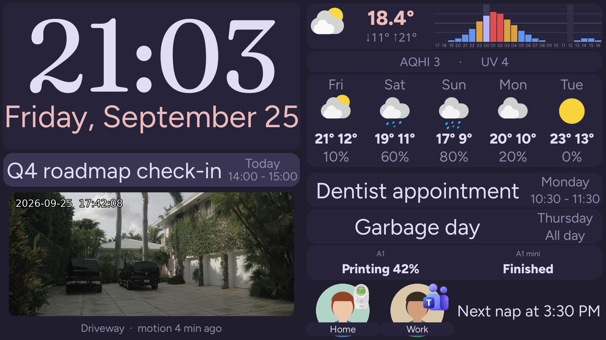

# Grydgets

Grydgets draws widget-based dashboards that update in real time, showing local and online data. It runs on anything
that supports Python, PyGame, and SDL, from the oldest Raspberry Pi to a full-blown modern PC.



**The full documentation is at [iamjackg.github.io/grydgets](https://iamjackg.github.io/grydgets/).**

This README covers enough to get a dashboard on screen, but the full site has everything else.

_Note:_ while the vast majority of the codebase was originally written by me, my free time has been dwindling more and more. Recent changes have been almost entirely developed with Claude Code. I have reviewed and tested the output, and I am using Grydgets myself 24/7 around the house. This is a fairly low-stakes project, with my only real constraint being that it still has to be efficient enough to run on a Raspberry Pi. So far I have managed to keep that goal.

## What it can do

*   **A grid of widgets** laid out proportionally: clocks, text, images, bar charts, and containers that
    cycle through their children or label them. See [Widgets](https://iamjackg.github.io/grydgets/widgets/).
*   **Data from anywhere over HTTP**, extracted with [a path or a jq expression](https://iamjackg.github.io/grydgets/configuration/data-extraction/),
    either per widget or through a [shared provider](https://iamjackg.github.io/grydgets/configuration/providers-yaml/) so several widgets can read one
    response.
*   **Several outputs at once**: window, PNG on disk, HTTP POST to a networked display, or a live stream to other
    machines. See [Outputs](https://iamjackg.github.io/grydgets/configuration/conf-yaml/#outputs).
*   **[Theming support](https://iamjackg.github.io/grydgets/theming/)** including automatic day and night theme switching
    that follows the sun.
*   **[Remote displays](https://iamjackg.github.io/grydgets/remote-displays/)**: render on one machine and show the result on several others with
    `grydgets-client`.
*   **[Hot reload](https://iamjackg.github.io/grydgets/hot-reload/)** on `SIGUSR1`, so you can change the dashboard without restarting it.
*   **A [widget editor](https://iamjackg.github.io/grydgets/widget-editor/)** in the browser, if you'd rather not write the YAML by hand.

## Installation

```bash
git clone https://github.com/iamjackg/grydgets
cd grydgets

uv tool install .
```

This installs the `grydgets` command (plus `grydgets-client` and `grydgets-editor`), so you can run it from any
directory. You'll need [uv](https://docs.astral.sh/uv/) and Python 3.9 or newer. If you'd rather use a plain
virtualenv, `python3 -m venv venv && venv/bin/pip install .` works too.

To update an existing installation:

```bash
git pull
uv tool install --reinstall .    # or: venv/bin/pip install .
```

You can also run `python main.py` from the repository if you'd rather not install the package, as long as the
dependencies are installed in that Python.

A Dockerfile and a docker-compose configuration are included for running Grydgets without a screen. See
[Install](https://iamjackg.github.io/grydgets/install/#docker-headless-mode).

### Command-line options

```
grydgets [--widgets FILE] [--theme FILE] [--config-dir DIR]
```

*   `--widgets`: Widget configuration file. Defaults to `widgets.yaml`.
*   `--theme`: A [theme file](https://iamjackg.github.io/grydgets/theming/#theme-files) to use instead of the widgets file's own `theme:` block. Using this turns off [day/night switching](https://iamjackg.github.io/grydgets/configuration/conf-yaml/#appearance-day-and-night-themes) if `conf.yaml` configures it.
*   `--config-dir`: Directory containing config files, fonts, and images. All relative paths are resolved from here. Defaults to the current working directory.

`grydgets-client` shows a dashboard that's rendered on another machine (see [Remote
displays](https://iamjackg.github.io/grydgets/remote-displays/)), and `grydgets-editor` starts the [widget editor](https://iamjackg.github.io/grydgets/widget-editor/).

## A first dashboard

Grydgets reads a handful of YAML files from the current directory, or from the directory passed with `--config-dir`.
Only two of them are required, but the example below uses all four, plus a theme, so you can see how they fit
together. It draws a clock next to the title of the next event on a Home Assistant calendar.

**`conf.yaml`** says how Grydgets runs on this machine: the resolution, and where the rendered dashboard goes.

```yaml
graphics:
  fps-limit: 10
  resolution: [800, 480]

logging:
  level: info

outputs:
  - type: window
    fullscreen: false
```

**`secrets.yaml`** keeps tokens and URLs out of the other files, which can then refer to them with `!secret`. Leave it
out of version control.

```yaml
calendar_url: https://homeassistant.local:8123/api/calendars/calendar.family
calendar_token: Bearer eyJhbGciOi...
```

**`providers.yaml`** describes data that gets fetched once and shared between widgets. You only really need it if more
than one widget reads the same response. In this example only one widget does, so a `rest` widget would work just as
well, but it's a good excuse to show what a provider looks like.

```yaml
providers:
  calendar:
    type: rest
    url: !secret calendar_url
    headers:
      Authorization: !secret calendar_token
    update_interval: 60
```

**`widgets.yaml`** is the dashboard itself: a tree of widgets, and a `theme:` block that gives names to the colors and
sizes the tree uses.

```yaml
theme:
  colors:
    background: '#2e3440'
    panel: '#3b4252'
    text: '#eceff4'
    accent: '#8fbcbb'
  sizes:
    radius: 12

  groups:
    text-like: [text, provider]
  defaults:
    text-like:
      color: !color text
    grid:
      widget_background_color: !color panel
      widget_corner_radius: !size radius

background_color: !color background

widgets:
  - widget: grid
    rows: 1
    columns: 2
    padding: 8
    column_ratios: [2, 3]
    children:
      - widget: dateclock
        time_color: !color text
        date_color: !color accent

      - widget: label
        text: 'Next up'
        position: above
        text_size: 24
        children:
          - widget: provider
            providers: [calendar]
            data_path: '[0].summary'
            fallback_text: 'Nothing today'
```

Run `grydgets` in the same directory, and a window should open with the clock on the left and the calendar entry on the right.

If you'd rather build up to something like this one step at a time, [Your first dashboard](https://iamjackg.github.io/grydgets/tutorial/) walks
you through it in tutorial form. Otherwise, [Widgets](https://iamjackg.github.io/grydgets/widgets/) lists everything you can put in the tree, and
[Theming](https://iamjackg.github.io/grydgets/theming/) explains the `!color` and `!size` tokens used above.

## Widgets

Here's every widget with a one-line description. Click through for their parameters and examples.

| Widget | What it does |
|---|---|
| [`grid`](https://iamjackg.github.io/grydgets/widgets/containers/#grid) | Lays its children out in a grid, with padding, backgrounds and rounded corners |
| [`label`](https://iamjackg.github.io/grydgets/widgets/containers/#label) | Adds a text label above or below a single child |
| [`flip`](https://iamjackg.github.io/grydgets/widgets/containers/#flip) | Cycles through its children at a fixed interval, with a transition |
| [`scheduleflip`](https://iamjackg.github.io/grydgets/widgets/containers/#scheduleflip) | A `flip` that picks a child based on the time of day |
| [`httpflip`](https://iamjackg.github.io/grydgets/widgets/containers/#httpflip) | A `flip` that picks a child based on the response to an HTTP request |
| [`pill`](https://iamjackg.github.io/grydgets/widgets/containers/#pill) | Draws a pill-shaped badge on top of a single child |
| [`text`](https://iamjackg.github.io/grydgets/widgets/text-and-clocks/#text) | Displays a fixed string |
| [`dateclock`](https://iamjackg.github.io/grydgets/widgets/text-and-clocks/#dateclock) | A 24-hour clock with the date underneath |
| [`rest`](https://iamjackg.github.io/grydgets/widgets/text-and-clocks/#rest) | Makes its own periodic HTTP request and displays the response |
| [`restimage`](https://iamjackg.github.io/grydgets/widgets/images/#restimage) | Periodically fetches an image and displays it |
| [`empty`](https://iamjackg.github.io/grydgets/widgets/images/#empty) | Takes up space, optionally as a colored block or divider |
| [`provider`](https://iamjackg.github.io/grydgets/widgets/provider-widgets/#provider) | Displays a value from a provider as text |
| [`providerflip`](https://iamjackg.github.io/grydgets/widgets/provider-widgets/#providerflip) | Picks a child based on provider data |
| [`providerimage`](https://iamjackg.github.io/grydgets/widgets/provider-widgets/#providerimage) | Displays an image whose URL comes from provider data |
| [`providerbarchart`](https://iamjackg.github.io/grydgets/widgets/provider-widgets/#providerbarchart) | Draws a minimal bar chart from a list of numbers |
| [`notifiabletext`](https://iamjackg.github.io/grydgets/widgets/push-widgets/#notifiabletext) | Shows a temporary text notification over its child |
| [`notifiableimage`](https://iamjackg.github.io/grydgets/widgets/push-widgets/#notifiableimage) | Shows a temporary image notification over its child |

## Documentation

*   [Install](https://iamjackg.github.io/grydgets/install/): uv, pip and Docker
*   [Your first dashboard](https://iamjackg.github.io/grydgets/tutorial/): a step-by-step walkthrough from an empty directory to a clock and live weather, with no API keys involved
*   [A more advanced dashboard](https://iamjackg.github.io/grydgets/advanced-tutorial/): carries on from the first one with a provider, weather icons, and flips that change based on the time and the forecast
*   [How the config files fit together](https://iamjackg.github.io/grydgets/config-files/): what each file is for, and which one to edit
*   [Configuration](https://iamjackg.github.io/grydgets/configuration/conf-yaml/): every key of `conf.yaml`, `widgets.yaml`, `providers.yaml` and `secrets.yaml`, plus colors, authentication and data extraction
*   [Widgets](https://iamjackg.github.io/grydgets/widgets/): parameters and examples for all of them
*   Features: [Theming](https://iamjackg.github.io/grydgets/theming/), [Remote displays](https://iamjackg.github.io/grydgets/remote-displays/), [Hot reload](https://iamjackg.github.io/grydgets/hot-reload/) and the [widget editor](https://iamjackg.github.io/grydgets/widget-editor/)
*   [Reference](https://iamjackg.github.io/grydgets/reference/): command-line options, HTTP endpoints, signals, and the JSON Schema for `widgets.yaml`

## Working on the docs

The site is built with [MkDocs](https://www.mkdocs.org/) and the
[Material theme](https://squidfunk.github.io/mkdocs-material/), from the Markdown files in `docs/`:

```bash
uv run --group docs mkdocs serve
```