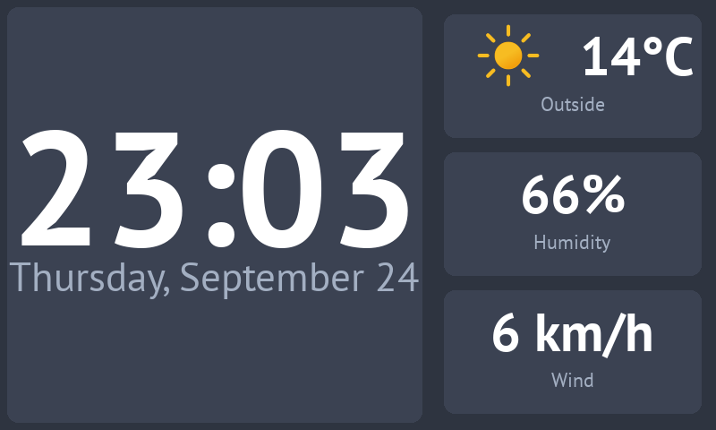
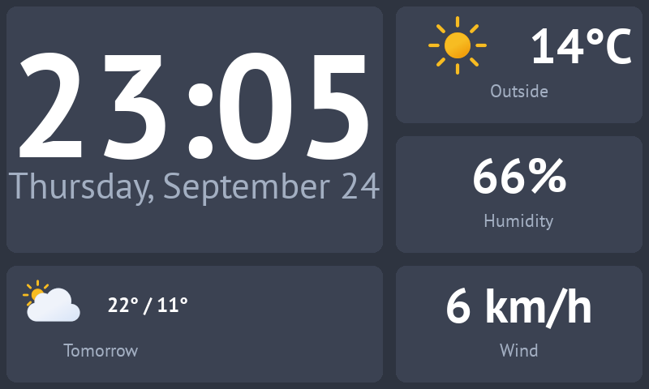
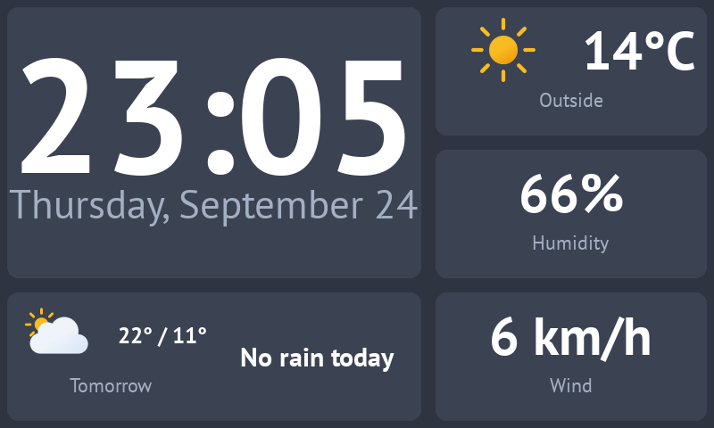

# A more advanced dashboard

This picks up where [Your first dashboard](tutorial.md) left off, in the same directory, with the `conf.yaml`,
`widgets.yaml` and `fonts` from its last step. By the end, the dashboard makes one request to wttr.in instead of
three, shows an icon for the current weather, switches from today's forecast to tomorrow's in the evening, and only
talks about rain when there's some coming.

Hot reload works for everything on this page, including the new `providers.yaml`, so you can keep Grydgets running
and send it `pkill -USR1 -x grydgets` after each change.

## 1. One request instead of three

At the moment, each of the three readouts asks wttr.in for the same JSON document on its own. A **provider** makes
the request once and shares the response with every widget that reads from it. Providers go in a third file,
`providers.yaml`, next to the other two:

```yaml title="providers.yaml"
providers:
  weather:
    type: rest
    url: 'https://wttr.in/Toronto?format=j1'
    update_interval: 900
```

`weather` is the name widgets will use to find it. Note that the option for how often to fetch is called
`update_interval` here, while on a `rest` widget it's `update_frequency`.

The widgets that read from a provider all start with `provider`. The one that shows text is just called `provider`,
and it's the counterpart of `rest`. Replace `widgets.yaml` with this:

```yaml title="widgets.yaml"
theme:
  defaults:
    dateclock:
      time_font_path: fonts/PTSans-Bold.ttf
      date_font_path: fonts/PTSans-Regular.ttf
    provider:
      font_path: fonts/PTSans-Bold.ttf
    label:
      font_path: fonts/PTSans-Regular.ttf

background_color: '#2e3440'

widgets:
  - widget: grid
    rows: 1
    columns: 2
    padding: 8
    column_ratios: [3, 2]
    children:
      - widget: dateclock
        background_color: '#3b4252'
        corner_radius: 12
        date_color: '#a3afc2'

      - widget: grid
        rows: 3
        columns: 1
        padding: 8
        widget_background_color: '#3b4252'
        widget_corner_radius: 12
        children:
          - widget: label
            text: 'Outside'
            position: below
            text_size: 22
            color: '#a3afc2'
            children:
              - widget: provider
                providers: [weather]
                data_path: 'current_condition[0].temp_C'
                format_string: '{value}°C'
                text_size: 60

          - widget: label
            text: 'Humidity'
            position: below
            text_size: 22
            color: '#a3afc2'
            children:
              - widget: provider
                providers: [weather]
                data_path: 'current_condition[0].humidity'
                format_string: '{value}%'
                text_size: 60

          - widget: label
            text: 'Wind'
            position: below
            text_size: 22
            color: '#a3afc2'
            children:
              - widget: provider
                providers: [weather]
                data_path: 'current_condition[0].windspeedKmph'
                format_string: '{value} km/h'
                text_size: 60
```

Three things changed on each readout:

*   `url` became `providers: [weather]`. It's a list, but it only takes one name.
*   `json_path` became `data_path`, which works exactly the same way.
*   `format_string` uses `{value}` where `rest` used `{}`.

The `rest` entry in `theme.defaults` also became `provider`, since that's the widget type now.

The dashboard should look exactly like it did at the end of the first tutorial. If a readout shows `--` instead of a
number, that's the provider widget's `fallback_text`: add `show_errors: true` to it and it'll show the actual error
instead.

## 2. An icon for the current weather

wttr.in describes the weather with a number called `weatherCode`: 113 is sunny, 116 is partly cloudy, 296 is light
rain, and so on. The whole list is on the [World Weather Online
site](https://www.worldweatheronline.com/weather-api/api/docs/weather-icons.aspx), which is where wttr.in gets its
forecasts.

A `providerimage` widget shows an image from a URL it reads out of the provider data, and that URL can point at a
local file. So if you save the icon for each code in a file named after the code, a single jq expression can turn
the code into the path of its icon, and you never have to write out a table matching codes to pictures.

First, the icons. [Meteocons](https://github.com/basmilius/weather-icons) are a lovely free set (MIT licensed) with
an icon for pretty much every kind of weather. This downloads the eleven that cover all of wttr.in's codes, and saves
a copy of each one for every code it stands for:

```bash
mkdir -p images/weather
while read -r icon codes; do
  curl -s "https://cdn.jsdelivr.net/gh/basmilius/weather-icons@2.0.0/design/fill/export/wi_$icon.svg" \
    | sed 's/viewBox="0 0 64 64"/& width="256" height="256"/' > "images/weather/$icon.svg"
  for code in $codes; do
    cp "images/weather/$icon.svg" "images/weather/$code.svg"
  done
done <<'EOF'
clear-day 113
partly-cloudy-day 116
cloudy 119
overcast 122
fog 143 248 260
drizzle 263 266
rain 176 293 296 299 302 305 308 353 356 359
sleet 179 182 185 281 284 311 314 317 350 362 365 374 377
snow 227 230 320 323 326 329 332 335 338 368 371 395
thunderstorms-rain 200 386 389
thunderstorms-snow 392
EOF
```

*   The `sed` line adds a width and a height to each icon. Grydgets draws an SVG at the size written in the file, and
    these are 64 pixels across, so without it they'd come out blurry once they're scaled up to fill a cell.
*   Each line of the list is an icon followed by the codes that should use it. All the kinds of rain get the rain
    icon, all the kinds of snow get the snow icon, and so on. Feel free to move codes around if you'd rather have more
    variety: Grydgets only ever looks at the file names.

Now give the temperature some company. Replace the child of the `Outside` label with a grid that puts the icon next
to the temperature:

```yaml title="widgets.yaml"
          - widget: label
            text: 'Outside'
            position: below
            text_size: 22
            color: '#a3afc2'
            children:
              - widget: grid
                rows: 1
                columns: 2
                padding: 0
                children:
                  - widget: providerimage
                    providers: [weather]
                    data_path: 'current_condition[0].weatherCode'
                    jq_expression: '"file://images/weather/" + . + ".svg"'
                    preserve_aspect_ratio: true
                  - widget: provider
                    providers: [weather]
                    data_path: 'current_condition[0].temp_C'
                    format_string: '{value}°C'
                    text_size: 60
```



Magic! Here's how the icon gets picked:

*   `data_path` digs out the code, like `"113"`.
*   `jq_expression` runs on whatever `data_path` found, which jq calls `.`, and glues it between a directory and an
    extension: `file://images/weather/113.svg`. The path is relative to the directory you're running Grydgets from.
*   `preserve_aspect_ratio: true` keeps the icon from being stretched to the shape of its cell.

!!! warning "Codes without an icon"

    If wttr.in ever sends a code you don't have a file for, the log will show a `File not found` warning, and the
    widget will keep showing whatever icon it had before, or nothing at all if it hasn't loaded one yet. Setting
    `fallback_image` gives it something to show at startup, but it won't replace an icon that's already on screen.

!!! note "The sun comes out at night"

    wttr.in uses 113 for clear nights as well as sunny days, so after dark the icon will still be a sun.

## 3. Tomorrow's forecast in the evening

By the evening, today's forecast isn't very useful anymore. A `scheduleflip` is a container that shows one of its
children at a time, picked by the time of day, so it can show today's forecast until 6 PM and tomorrow's after that.

It needs somewhere to live first. The forecast goes in a new panel under the clock, which means the left column
becomes a grid of its own: the clock on top, and a strip at the bottom with two halves. The forecast goes in the left
half now, and step 4 will fill the right one.

Replace everything from `widgets:` down to the start of the right-hand grid with this:

```yaml title="widgets.yaml"
widgets:
  - widget: grid
    rows: 1
    columns: 2
    column_ratios: [3, 2]
    children:
      - widget: grid
        rows: 2
        columns: 1
        padding: 8
        row_ratios: [2, 1]
        widget_background_color: '#3b4252'
        widget_corner_radius: 12
        children:
          - widget: dateclock
            date_color: '#a3afc2'

          - widget: grid
            rows: 1
            columns: 2
            children:
              - widget: scheduleflip
                schedule:
                  "00:00": forecast-today
                  "18:00": forecast-tomorrow
                children:
                  - widget: label
                    name: forecast-today
                    text: 'Today'
                    position: below
                    text_size: 22
                    color: '#a3afc2'
                    children:
                      - widget: grid
                        rows: 1
                        columns: 2
                        padding: 0
                        children:
                          - widget: providerimage
                            providers: [weather]
                            data_path: 'weather[0].hourly[4].weatherCode'
                            jq_expression: '"file://images/weather/" + . + ".svg"'
                            preserve_aspect_ratio: true
                          - widget: provider
                            providers: [weather]
                            data_path: 'weather[0]'
                            jq_expression: '"\(.maxtempC)° / \(.mintempC)°"'
                            text_size: 40

                  - widget: label
                    name: forecast-tomorrow
                    text: 'Tomorrow'
                    position: below
                    text_size: 22
                    color: '#a3afc2'
                    children:
                      - widget: grid
                        rows: 1
                        columns: 2
                        padding: 0
                        children:
                          - widget: providerimage
                            providers: [weather]
                            data_path: 'weather[1].hourly[4].weatherCode'
                            jq_expression: '"file://images/weather/" + . + ".svg"'
                            preserve_aspect_ratio: true
                          - widget: provider
                            providers: [weather]
                            data_path: 'weather[1]'
                            jq_expression: '"\(.maxtempC)° / \(.mintempC)°"'
                            text_size: 40

              - widget: empty

      - widget: grid
        rows: 3
        # ... the right-hand grid with the three readouts, as before
```



There's a fair bit going on here, so let's start with the layout:

*   The outer grid doesn't have `padding` anymore. The two grids inside it leave a gap around each of their own
    panels, and if the outer grid did the same, the space around the edges and between the two columns would be
    twice as wide as the space between panels.
*   The new left-hand grid paints the panels behind both of its rows, so the clock doesn't need its own
    `background_color` and `corner_radius`.
*   The strip at the bottom is a grid without padding or background, so both of its halves share the one panel.
*   `empty` doesn't draw anything. It holds the right half until step 4.

Then the `scheduleflip` itself. `schedule` maps a time to the `name` of the child to show from that time on:
`forecast-today` from midnight, and `forecast-tomorrow` from 6 PM. The last entry of the day runs until the first one
the next day, so at midnight tomorrow's forecast becomes today's. The times are in whatever timezone the machine
running Grydgets is set to. When it's time to switch, the children slide past each other, and you can change that
with `transition` and `ease`, the same as on a [`flip`](widgets/containers.md#flip).

The two children only differ in which day they read. wttr.in's `weather` list has one entry per day, starting
today, so `weather[0]` is today and `weather[1]` is tomorrow:

*   The daily entries don't have a `weatherCode` of their own, but each one has an `hourly` list with a forecast
    every three hours, starting at midnight. `hourly[4]` is the one for noon, which is a decent picture of what the
    day will be like.
*   `"\(.maxtempC)° / \(.mintempC)°"` uses jq's string interpolation: anything inside `\( )` gets replaced with its
    value, so this comes out as `22° / 11°`.

!!! tip "Backslashes in YAML"

    The jq expression is in single quotes on purpose: YAML leaves backslashes alone inside single quotes. In double
    quotes you'd have to write every `\(` as `\\(`.

## 4. Only mention rain when it's coming

A `providerflip` is another container that shows one of its children at a time. It picks the child based on a value
from a provider, so the right half of the strip can show the chance of rain when it's worth knowing about, and a
simple "No rain today" when it isn't.

Replace `- widget: empty` with this:

```yaml title="widgets.yaml"
              - widget: providerflip
                providers: [weather]
                jq_expression: 'if ([.weather[0].hourly[].chanceofrain | tonumber] | max) >= 40 then "rain" else "dry" end'
                default_widget: no-rain
                mapping:
                  rain: rain-chance
                  dry: no-rain
                children:
                  - widget: label
                    name: rain-chance
                    text: 'Chance of rain'
                    position: below
                    text_size: 22
                    color: '#a3afc2'
                    children:
                      - widget: provider
                        providers: [weather]
                        jq_expression: '[.weather[0].hourly[].chanceofrain | tonumber] | max'
                        format_string: '{value}%'
                        text_size: 60

                  - widget: text
                    name: no-rain
                    text: 'No rain today'
                    align: center
                    vertical_align: center
                    text_size: 30
```

"No rain today" is a plain `text` widget, which doesn't have a font default yet, so add one to the `theme` block at
the top:

```yaml title="widgets.yaml"
theme:
  defaults:
    # ... dateclock, provider and label as before
    text:
      font_path: fonts/PTSans-Bold.ttf
```



The trick is in how the flip decides:

*   `jq_expression` boils the whole forecast down to one word. `.weather[0].hourly[].chanceofrain` gets the chance of
    rain for each of today's eight slots. wttr.in sends them as strings, so `tonumber` turns them into numbers, and
    `max` keeps the highest one. If that's 40% or more, the result is `rain`, and otherwise it's `dry`.
*   `mapping` matches that word to the `name` of a child: `rain` shows `rain-chance`, and `dry` shows `no-rain`.
*   `default_widget` is the child shown at startup, before the provider has any data, and whenever the value doesn't
    match anything in `mapping`.

The `rain-chance` child runs the same `max` again to show the number itself, since the flip only passes a word
along, not the data behind it.

Note that this looks at the whole of today, including the hours that have already gone by. So after 6 PM, the
forecast on the left is about tomorrow while the rain on the right is still about today. If that bothers you, the
rain half can become a `scheduleflip` of its own, with a `providerflip` for each day inside it.

??? example "The finished `widgets.yaml`"

    ```yaml title="widgets.yaml"
    theme:
      defaults:
        dateclock:
          time_font_path: fonts/PTSans-Bold.ttf
          date_font_path: fonts/PTSans-Regular.ttf
        provider:
          font_path: fonts/PTSans-Bold.ttf
        label:
          font_path: fonts/PTSans-Regular.ttf
        text:
          font_path: fonts/PTSans-Bold.ttf

    background_color: '#2e3440'

    widgets:
      - widget: grid
        rows: 1
        columns: 2
        column_ratios: [3, 2]
        children:
          - widget: grid
            rows: 2
            columns: 1
            padding: 8
            row_ratios: [2, 1]
            widget_background_color: '#3b4252'
            widget_corner_radius: 12
            children:
              - widget: dateclock
                date_color: '#a3afc2'

              - widget: grid
                rows: 1
                columns: 2
                children:
                  - widget: scheduleflip
                    schedule:
                      "00:00": forecast-today
                      "18:00": forecast-tomorrow
                    children:
                      - widget: label
                        name: forecast-today
                        text: 'Today'
                        position: below
                        text_size: 22
                        color: '#a3afc2'
                        children:
                          - widget: grid
                            rows: 1
                            columns: 2
                            padding: 0
                            children:
                              - widget: providerimage
                                providers: [weather]
                                data_path: 'weather[0].hourly[4].weatherCode'
                                jq_expression: '"file://images/weather/" + . + ".svg"'
                                preserve_aspect_ratio: true
                              - widget: provider
                                providers: [weather]
                                data_path: 'weather[0]'
                                jq_expression: '"\(.maxtempC)° / \(.mintempC)°"'
                                text_size: 40

                      - widget: label
                        name: forecast-tomorrow
                        text: 'Tomorrow'
                        position: below
                        text_size: 22
                        color: '#a3afc2'
                        children:
                          - widget: grid
                            rows: 1
                            columns: 2
                            padding: 0
                            children:
                              - widget: providerimage
                                providers: [weather]
                                data_path: 'weather[1].hourly[4].weatherCode'
                                jq_expression: '"file://images/weather/" + . + ".svg"'
                                preserve_aspect_ratio: true
                              - widget: provider
                                providers: [weather]
                                data_path: 'weather[1]'
                                jq_expression: '"\(.maxtempC)° / \(.mintempC)°"'
                                text_size: 40

                  - widget: providerflip
                    providers: [weather]
                    jq_expression: 'if ([.weather[0].hourly[].chanceofrain | tonumber] | max) >= 40 then "rain" else "dry" end'
                    default_widget: no-rain
                    mapping:
                      rain: rain-chance
                      dry: no-rain
                    children:
                      - widget: label
                        name: rain-chance
                        text: 'Chance of rain'
                        position: below
                        text_size: 22
                        color: '#a3afc2'
                        children:
                          - widget: provider
                            providers: [weather]
                            jq_expression: '[.weather[0].hourly[].chanceofrain | tonumber] | max'
                            format_string: '{value}%'
                            text_size: 60

                      - widget: text
                        name: no-rain
                        text: 'No rain today'
                        align: center
                        vertical_align: center
                        text_size: 30

          - widget: grid
            rows: 3
            columns: 1
            padding: 8
            widget_background_color: '#3b4252'
            widget_corner_radius: 12
            children:
              - widget: label
                text: 'Outside'
                position: below
                text_size: 22
                color: '#a3afc2'
                children:
                  - widget: grid
                    rows: 1
                    columns: 2
                    padding: 0
                    children:
                      - widget: providerimage
                        providers: [weather]
                        data_path: 'current_condition[0].weatherCode'
                        jq_expression: '"file://images/weather/" + . + ".svg"'
                        preserve_aspect_ratio: true
                      - widget: provider
                        providers: [weather]
                        data_path: 'current_condition[0].temp_C'
                        format_string: '{value}°C'
                        text_size: 60

              - widget: label
                text: 'Humidity'
                position: below
                text_size: 22
                color: '#a3afc2'
                children:
                  - widget: provider
                    providers: [weather]
                    data_path: 'current_condition[0].humidity'
                    format_string: '{value}%'
                    text_size: 60

              - widget: label
                text: 'Wind'
                position: below
                text_size: 22
                color: '#a3afc2'
                children:
                  - widget: provider
                    providers: [weather]
                    data_path: 'current_condition[0].windspeedKmph'
                    format_string: '{value} km/h'
                    text_size: 60
    ```

## What to read next

*   [Theming](theming.md). `'#a3afc2'` is now written out seven times, and a theme token lets you write it once.
*   [Data extraction](configuration/data-extraction.md), for more on `data_path` and jq.
*   [`httpflip`](widgets/containers.md#httpflip) works like `providerflip` but makes its own request, which is
    simpler when only one widget needs the answer.
*   [`providerbarchart`](widgets/provider-widgets.md#providerbarchart) could draw the chance of rain for every slot
    of the day as a bar chart, instead of just the highest one.
