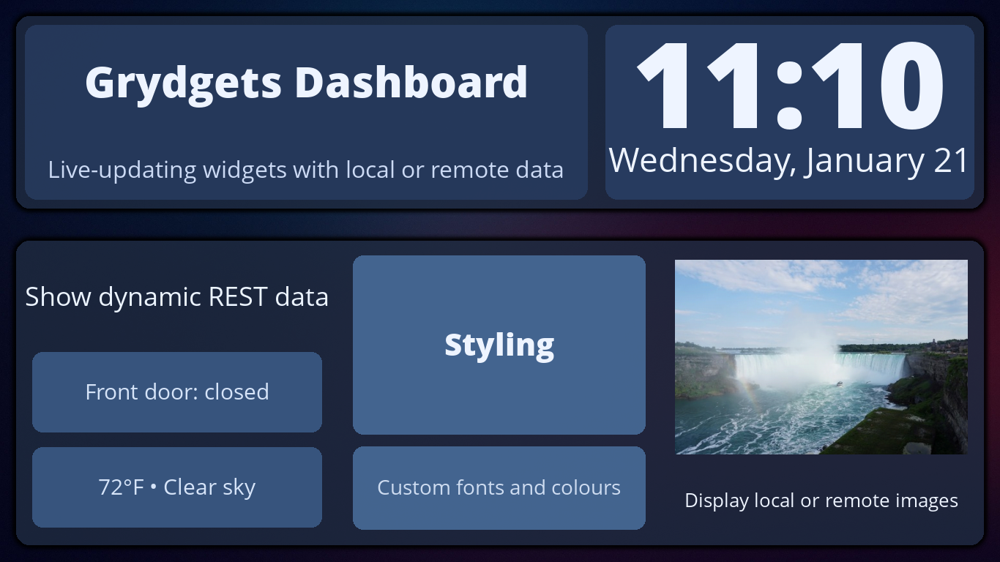

# Grydgets

Grydgets draws widget-based dashboards that update in real time, showing local and online data. You describe the dashboard as a tree of container and data widgets in a YAML file. It runs on anything
that supports Python, PyGame, and SDL, from the oldest Raspberry Pi to a full-blown modern PC.

## What it can do

*   **A grid of widgets** that lay themselves out proportionally: clocks, text, images, bar charts, and containers that
    cycle through their children or label them. See [Widgets](widgets/index.md).
*   **Data from anywhere over HTTP**, extracted with [a path or a jq expression](configuration/data-extraction.md),
    either per widget or through a [shared provider](configuration/providers-yaml.md) so several widgets can read one
    response.
*   **Several outputs at once**: a window, a PNG on disk, an HTTP POST to a networked display, or
    a live stream to other machines. See [Outputs](configuration/conf-yaml.md#outputs).
*   **[Themes](theming.md)** that move colors, fonts and sizes out of the layout, including a day and a night theme
    that follow the sun.
*   **[Remote displays](remote-displays.md)**: render on one machine and show the result on several others with
    `grydgets-client`.
*   **[Hot reload](hot-reload.md)** on `SIGUSR1`, so you can change the dashboard without restarting it.
*   **A [widget editor](widget-editor.md)** in the browser, if you'd rather not write the YAML by hand.

## Where to start

[Install](install.md) it, then follow [Your first dashboard](tutorial.md): it takes you from an empty directory to a
clock and a live temperature on screen. After that, [How the config files
fit together](config-files.md) explains what each file is for, [Configuration](configuration/conf-yaml.md) describes
every key in them, and [Widgets](widgets/index.md) has the parameters for every widget.

!!! note "How Grydgets is made"

    While the vast majority of the codebase was originally written by me, my free time has been dwindling more and
    more. Recent changes have been almost entirely developed with Claude Code. I have reviewed and tested the output, and I am using Grydgets myself 24/7 around the house. This is a fairly low-stakes project, with my only real constraint being that it still has to be efficient enough to run on a Raspberry Pi. So far I have managed to keep that goal.
