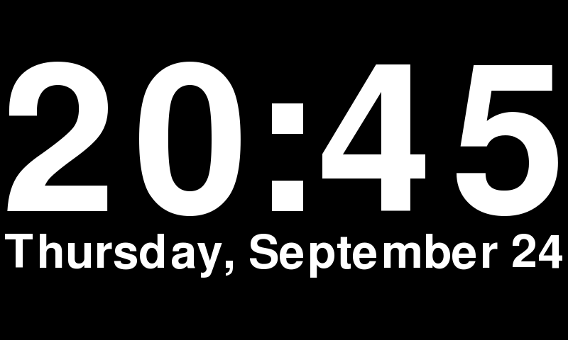
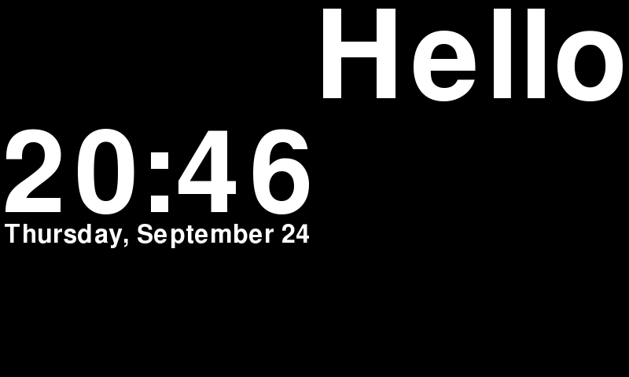
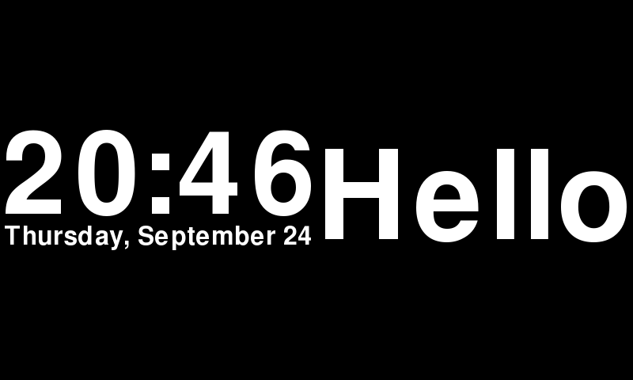
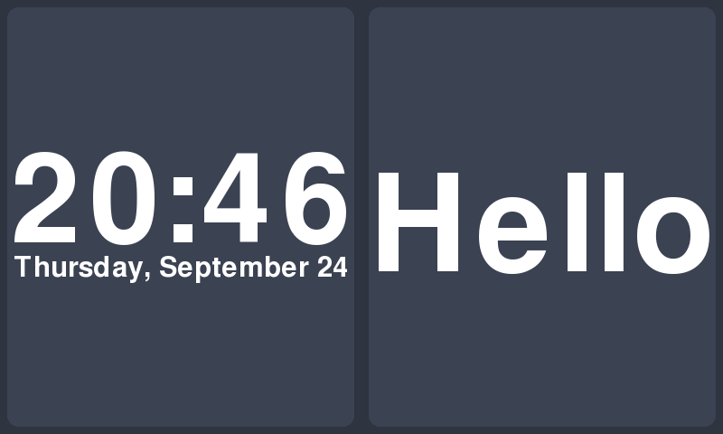
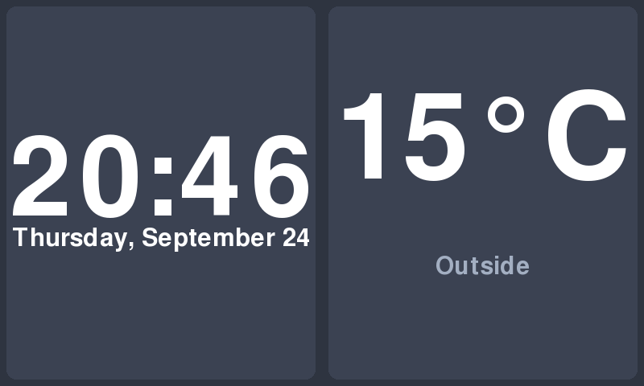
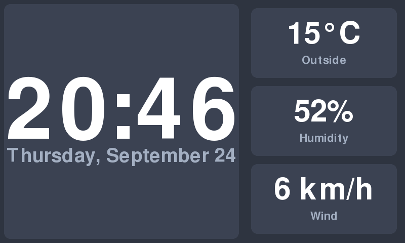
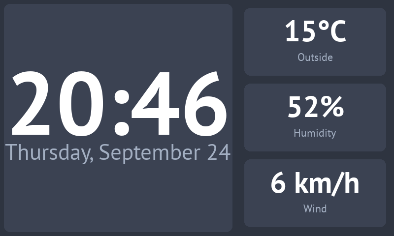

# Your first dashboard

This walks you from an empty directory to a dashboard with a clock down one side and live weather
readouts down the other. All you need is Grydgets [installed](install.md) so that the `grydgets`
command works.

Make a directory to work in and run everything from inside it. Grydgets looks for its configuration
in the current directory.

```bash
mkdir grydgets-tutorial
cd grydgets-tutorial
```

## 1. A simple clock

Grydgets needs two files to start. The first one, `conf.yaml`, describes how it runs on this
particular machine:

```yaml title="conf.yaml"
graphics:
  fps-limit: 10
  resolution: [800, 480]

logging:
  level: info

outputs:
  - type: window
```

*   `fps-limit`: the most times per second the dashboard gets redrawn. Clocks update once a
    minute, so 10 is plenty. Keep this low on slow devices like a Raspberry Pi: I use 1 fps on mine.
*   `resolution`: the size of the dashboard, in pixels.
*   `logging.level`: `debug`, `info`, or `warning`. `debug` is very verbose, but it's helpful to see how grydgets lays everything out when you're first starting out.
*   `outputs`: where the finished picture goes. A `window` is the easy one to start with, but this is
    also where you'd configure Grydgets to save to a file on disk or send to
    [another machine entirely](remote-displays.md).

The second file, `widgets.yaml`, is the dashboard itself. For the moment let's add exactly *one*
widget:

```yaml title="widgets.yaml"
widgets:
  - widget: dateclock
```

Every widget has a `widget:` key naming its type. Run it:

```bash
grydgets
```



There! The clock gets the entire window, since there's nothing else to share it with. Since we didn't specify a `text_size`, the clock grew to fit whatever space it was handed, which is why the numbers are
quite that enormous.

On startup, Grydgets prints a "Hello from the pygame community" line. That comes from
[PyGame](https://pyga.me/), the library Grydgets draws with, and you can ignore it. The rest of the
log is Grydgets telling you what it loaded, and if something goes wrong later, this is where the
error will show up.

!!! warning "On a Raspberry Pi without a desktop"

    Set `fullscreen: true` on the `window` output and start Grydgets as usual. When there's no
    desktop to open a window in, the window takes over the whole screen directly instead. See
    [Running without a desktop](configuration/conf-yaml.md#running-without-a-desktop) for the details.

To quit, close the window, or click anywhere inside it.

Keep Grydgets running for the rest of the tutorial. You
can tell it to reload the widget file again without restarting, by running this in another terminal each time
you save a change:

```bash
pkill -USR1 -x grydgets
```

This is called a [hot reload](hot-reload.md). If you'd rather not bother, quitting and running
`grydgets` again works just as well.

## 2. Two widgets side by side

To get multiple widgets on the screen, you have to tell Grydgets how to
divide up the space. That's the job of a **container widget**: one whose children are other widgets. The
container you'll use most is `grid`, which takes a number of rows and columns and draws its
`children` into the cells.

!!! note "Grids fill a column at a time"

    The first child goes top left, and the next one goes *underneath* it rather than beside it. With
    a single row, like the one below, there's no difference. As soon as you add a second row it
    matters a lot.

Replace `widgets.yaml` with this:

```yaml title="widgets.yaml"
widgets:
  - widget: grid
    rows: 1
    columns: 2
    children:
      - widget: dateclock
      - widget: text
        text: 'Hello'
```



The clock has moved into the left half and there is a big Hello in the right one, though you'd be forgiven for not
seeing a grid there: the grid doesn't draw anything to show where one cell stops and the next one
starts. Step 3 will make things nicer.

The widget in each cell is automatically sized to fit its own contents. Since "Hello" is a much shorter string than the date, it gets blown up to a much bigger size to fill its half.

You've probably also noticed that Hello is stuck at the top of its cell, while the clock
is nicely centred. That's just the defaults: a `text` widget starts at the top left, and `dateclock`
centres itself. You can change that with `align` (`left`, `center` or `right`) and `vertical_align`
(`top`, `center` or `bottom`):

```yaml
      - widget: text
        text: 'Hello'
        align: center
        vertical_align: center
```



Cells are all the same size by default. You can use `row_ratios` and `column_ratios` to change that, so
`column_ratios: [2, 3]` would give the right column 1.5 times the width of the left one. Grids can be nested without a problem: a cell can hold another grid, and most real dashboards are built out of a bunch of grids inside each other.

!!! note "Hyphens and underscores"

    `conf.yaml` uses hyphens in its keys (`fps-limit`), while widgets use underscores
    (`vertical_align`, `column_ratios`). If you have a wrong key in `conf.yaml` Grydgets won't start, but
    misspelled widget parameters are ignored without a warning, so if a setting doesn't seem to do
    anything, check its spelling first. If your editor supports it, [`schema.json`](reference.md#schemajson)
    will catch these as you type.

## 3. Make it look nicer

So far it's white text on black. Kinda boring. Thankfully, grids can apply colours to their cells:

```yaml title="widgets.yaml"
background_color: '#2e3440'

widgets:
  - widget: grid
    rows: 1
    columns: 2
    padding: 8
    widget_background_color: '#3b4252'
    widget_corner_radius: 12
    children:
      - widget: dateclock
      - widget: text
        text: 'Hello'
        align: center
        vertical_align: center
```



`padding` is the gap left around each cell. `widget_background_color` and `widget_corner_radius` are
applied to every cell separately, so each half of the screen gets its own rounded panel, and you can
finally see where the grid cells actually are.

!!! warning "Quote your hex colours"

    An unquoted `#` starts a comment in YAML, so `background_color: #2e3440` would parse as an empty
    value and Grydgets would stop at startup with `background_color: None is not a colour`.

!!! tip

    Every colour parameter also supports `[r, g, b]` lists of floats from 0.0 to 1.0 as well, if you like that better. See
    [Colors](configuration/colors.md).

## 4. Show live data

So far, every widget has drawn something that was written in the file. The `rest` widget goes out
and gets its own data instead: it makes an HTTP request on a timer, digs a value out of the JSON that
comes back, and draws that.

To see how it all works, we can use the always excellent [wttr.in](https://wttr.in), which hands you a weather
report for any city in the world without asking for an API key.

While we're here, `label` is another container. It takes a single child and puts a caption above or
below it:

```yaml title="widgets.yaml"
background_color: '#2e3440'

widgets:
  - widget: grid
    rows: 1
    columns: 2
    padding: 8
    widget_background_color: '#3b4252'
    widget_corner_radius: 12
    children:
      - widget: dateclock
      - widget: label
        text: 'Outside'
        position: below
        text_size: 30
        color: '#a3afc2'
        children:
          - widget: rest
            url: 'https://wttr.in/Toronto?format=j1'
            json_path: 'current_condition[0].temp_C'
            format_string: '{}°C'
            text_size: 150
            update_frequency: 900
```



The `rest` widget takes these parameters:

*   `url`: what to request. In this case, the weather in Toronto.
*   `json_path`: where to find the value in the JSON response. `current_condition[0].temp_C` takes the first entry of the `current_condition` list
    and then its `temp_C` field. For anything more involved than a path there's `jq_expression`, see
    [Data extraction](configuration/data-extraction.md).
*   `format_string`: a Python format string to apply to the result.
*   `text_size`: a cap, in pixels, on how big the text is allowed to get. If the text is too big to fit inside the cell, it will shrink below `text_size` until it fits.
*   `update_frequency`: how often to request new data, in seconds. It defaults to 30, but that's a lot
    to ask of a free service for a number that changes every few hours, so in our example we increased it to 900.

`text_size` is the fix for the problem you saw back in step 2, where Hello came out enormous. The `rest` widget centres its text by default, so you don't need `align` here.

The `rest` widget is the child of a `label`, which takes `position: below` to put the caption under its child instead of
above it. `color` is set to grey rather than white like the temperature, so the two lines
don't compete visually. The caption always gets a third of the cell's height, which is why there's a bit of a
gap between the two in a cell this tall. We'll fix this in the next step, where the cells get
shorter.

## 5. Room for more than one number

Half a screen for a single temperature is a bit of a waste. As mentioned in step 2, a grid cell can
hold another grid, so the right-hand half can be split into three readouts of its own.

There's one snag. A grid paints `widget_background_color` behind *every* one of its cells, so leaving
it on the outer grid would put a panel behind the inner grid, and then the inner grid would paint
three more panels on top of it. To avoid that, we'll change the outer grid to not paint anything, the inner one
paints its three cells, and the clock gets its own background parameter: `dateclock` takes a `background_color`
and a `corner_radius` directly, so you don't have to wrap it in a grid to give it a panel.

```yaml title="widgets.yaml"
background_color: '#2e3440'

widgets:
  - widget: grid
    rows: 1
    columns: 2
    padding: 8
    column_ratios: [3, 2]
    children:
      - widget: dateclock
        background_color: '#3b4252'
        corner_radius: 12
        date_color: '#a3afc2'

      - widget: grid
        rows: 3
        columns: 1
        padding: 8
        widget_background_color: '#3b4252'
        widget_corner_radius: 12
        children:
          - widget: label
            text: 'Outside'
            position: below
            text_size: 22
            color: '#a3afc2'
            children:
              - widget: rest
                url: 'https://wttr.in/Toronto?format=j1'
                json_path: 'current_condition[0].temp_C'
                format_string: '{}°C'
                text_size: 60
                update_frequency: 900

          - widget: label
            text: 'Humidity'
            position: below
            text_size: 22
            color: '#a3afc2'
            children:
              - widget: rest
                url: 'https://wttr.in/Toronto?format=j1'
                json_path: 'current_condition[0].humidity'
                format_string: '{}%'
                text_size: 60
                update_frequency: 900

          - widget: label
            text: 'Wind'
            position: below
            text_size: 22
            color: '#a3afc2'
            children:
              - widget: rest
                url: 'https://wttr.in/Toronto?format=j1'
                json_path: 'current_condition[0].windspeedKmph'
                format_string: '{} km/h'
                text_size: 60
                update_frequency: 900
```



`column_ratios: [3, 2]` splits the two columns three parts to two, so the clock gets the bigger
share. The three readouts are capped at 60 instead of 150 because they're in much shorter cells now,
and by using the same cap the two-digit humidity and the six-character wind speed don't
render at different sizes.

## 6. A nicer font

Everything so far has been drawn with PyGame's built-in font, FreeSans Bold. It does the job, but
it's a bit plain, and some characters look slightly off: note the gaps around the `°` in the
temperature.

Any `.ttf` file will do. [PT Sans](https://fonts.google.com/specimen/PT+Sans) is a good one to start
with: it's free to use under the [Open Font License](https://openfontlicense.org/), and it looks a little more interesting. Download the regular and bold versions into a `fonts` directory:

```bash
mkdir fonts
curl -L -o fonts/PTSans-Regular.ttf https://github.com/google/fonts/raw/main/ofl/ptsans/PT_Sans-Web-Regular.ttf
curl -L -o fonts/PTSans-Bold.ttf https://github.com/google/fonts/raw/main/ofl/ptsans/PT_Sans-Web-Bold.ttf
```

All widgets that draw text take a font parameter: `font_path` on `rest` and `label`, and
`time_font_path` and `date_font_path` on `dateclock`. You could add those to all seven widgets, but
there's a shorter way. Add a `theme` block at the top of `widgets.yaml`, next to `background_color`,
and leave the `widgets:` part exactly as it was:

```yaml title="widgets.yaml"
theme:
  defaults:
    dateclock:
      time_font_path: fonts/PTSans-Bold.ttf
      date_font_path: fonts/PTSans-Regular.ttf
    rest:
      font_path: fonts/PTSans-Bold.ttf
    label:
      font_path: fonts/PTSans-Regular.ttf

background_color: '#2e3440'

widgets:
  # ... the same as in step 5
```



`theme.defaults` sets parameters for every widget of a given type (but you can still override them on individual widgets). Paths are relative to the directory you're running Grydgets from, like every other path in
the configuration.

## What to read next

That's it for the basics. Every dashboard is a tree of widgets, where some of them arrange the
others and some of them go off and fetch data. Most of what's left to learn is the individual
widgets and their parameters.

The dashboard you just built still has a couple things to improve on. Reading the rest of the documentation shows you how to deal with them. The first is that `'#3b4252'`, `text_size: 22` and `color: '#a3afc2'` are written
out three and four times each, so if you want to change the look of the dashboard you have to change
every copy. [Theming](theming.md) lets you give those values names and set more defaults, the same
way you just did for fonts. The second is that three widgets are asking wttr.in for the same JSON
document. A shared provider can make that request once and hand the response to all three widgets,
see [providers.yaml](configuration/providers-yaml.md).

*   [A more advanced dashboard](advanced-tutorial.md) carries on from here: it moves the weather into a
    provider, adds icons, and uses flips to change what's on screen based on the time and the forecast.
*   [How the config files fit together](config-files.md) covers the two files you just wrote and the
    two you didn't, and when you'd want them.
*   [Widgets](widgets/index.md) lists all 17 of them, with every parameter.
*   [Theming](theming.md) gives colours, fonts and sizes names, and sets defaults per widget type so
    that most widgets don't have to mention them at all.
*   [Remote displays](remote-displays.md), for when the screen on which you want to display the dashboard isn't the machine
    you want to render it on.
